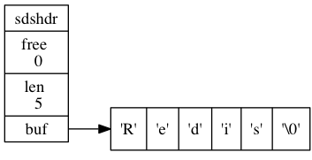

# 底层数据结构

## 简单动态字符串

|        | C字符串                                                      | SDS字符串                                                    |
| ------ | ------------------------------------------------------------ | ------------------------------------------------------------ |
| 示意图 |  |  |
| 结构   | 使用长度为 `N+1` 的字符数组来表示长度为 `N` 的字符串， 并且字符数组的最后一个元素总是空字符 `'\0'` | `free`保存剩余存储空间<br />`len`保存字符串实际长度空间<br />`buf`为一个字节数组，保存字符串内容，数组实际大小为`free+len+1` |
| 区别   | 获取字符串长度的复杂度为 O(N) <br />API 是不安全的，可能会造成缓冲区溢出<br />修改字符串长度 `N` 次必然需要执行 `N` 次内存重分配<br />只能保存文本数据<br /> | 获取字符串长度的复杂度为 O(1) <br />API 是安全的，不会造成缓冲区溢出<br />修改字符串长度 `N` 次最多需要执行 `N` 次内存重分配<br />可以保存文本或者二进制数据 |

### SDS字符串扩容

SDS字符串通过**惰性空间释放**和**空间预分配**来减少字符串修改导致的内存重分配次数

**惰性空间释放**：即当字符串操作导致字符串变短时，空闲出的内存不马上释放，而是加入到`free`保存，以便有增长字符串长度时，要重新分配内存

**空间预分配**：当对一个 SDS 进行修改并需要进行空间扩展时， 不仅会为 SDS 分配修改所必须要的空间， 还会为 SDS 分配额外的未使用空间。例如修改后的字符串占用`1M`，则`free`将等于`1M`，字符串buf数组的实际长度`free+len+1`，具体分配额外未使用空间`V(x)`的大小计算如下，`x`为修改后SDS长度（`len` 属性的值）：
$$
V(x)=\left\{
\begin{aligned}
x & & x<1M \\
1M & & x\geq1M
\end{aligned}
\right.
$$

## 链表


链表结构体

```C
typedef struct list {
    // 表头节点
    listNode *head;
    // 表尾节点
    listNode *tail;
    // 链表所包含的节点数量
    unsigned long len;
    
    // 节点值复制函数
    void *(*dup)(void *ptr);
    // 节点值释放函数
    void (*free)(void *ptr);
    // 节点值对比函数
    int (*match)(void *ptr, void *key);
} list;
```

链表结点结构体

```C
typedef struct listNode {
    // 前置节点
    struct listNode *prev;
    // 后置节点
    struct listNode *next;
    // 节点的值
    void *value;
} listNode;
```

Redis 的链表特性总结如下：

- 双端： 链表节点带有 `prev` 和 `next` 指针， 获取某个节点的前置节点和后置节点的复杂度都是 O(1) 
- 无环： 表头节点的 `prev` 指针和表尾节点的 `next` 指针都指向 `NULL` ， 对链表的访问以 `NULL` 为终点
- 带表头指针和表尾指针： 通过 `list` 结构的 `head` 指针和 `tail` 指针， 程序获取链表的表头节点和表尾节点的复杂度为 O(1) 
- 带链表长度计数器： 程序使用 `list` 结构的 `len` 属性来对 `list` 持有的链表节点进行计数， 程序获取链表中节点数量的复杂度为 O(1) 
- 多态： 链表节点使用 `void*` 指针来保存节点值， 并且可以通过 `list` 结构的 `dup` 、 `free` 、 `match` 三个属性为节点值设置类型特定函数， 所以链表可以用于保存各种不同类型的值

## 哈希表


哈希表数据结构

```
typedef struct dictht {
    // 哈希表数组
    dictEntry **table;
    // 哈希表大小
    unsigned long size;
    // 哈希表大小掩码，用于计算索引值
    // 总是等于 size - 1
    unsigned long sizemask;
    // 该哈希表已有节点的数量
    unsigned long used;
} dictht;
```

哈希表结点

```
typedef struct dictEntry {
    // 键
    void *key;
    // 值
    union {
        void *val;
        uint64_t u64;
        int64_t s64;
    } v;
    // 指向下个哈希表节点，形成链表
    struct dictEntry *next;
} dictEntry;
```

## 字典

字典使用哈希表作为底层实现


```
typedef struct dict {
    // 类型特定函数，指向 dictType 结构的指针， 每个 dictType 结构保存了一簇用于操作特定类型键值对的函数
    dictType *type;
    // 私有数据，保存了需要传给那些类型特定函数的可选参数
    void *privdata;
    // 包含两个项的数组， 数组中的每个项都是一个 dictht 哈希表， 一般情况下， 字典只使用 ht[0] 哈希表， ht[1] 哈希表只会在对 ht[0] 哈希表进行 rehash 时使用
    dictht ht[2];
    // 当没有进行重哈希时，值为 -1
    int rehashidx; 
} dict;
```

对于关键字key最终的存储位置由以下步骤得出：

1.使用哈希函数计算哈希值

2.计算索引值

3.如有冲突，则使用冲突策略解决冲突

4.为平衡冲突与空间占用，当负载因子处于非合理水平时，哈希表进行扩容或收缩，表内数据进行重哈希

### 哈希函数

哈希函数能将关键字集合均匀地分布在地址集`{0,1，…，m-1}`上，使冲突最小

```
# 1.使用字典设置的哈希函数，计算键 key 的哈希值
hash = dict->type->hashFunction(key);

# 使用哈希表的 sizemask 属性和哈希值，计算出索引值
# 根据情况不同， ht[x] 可以是 ht[0] 或者 ht[1]
index = hash & dict->ht[x].sizemask;
```

### 冲突解决


### 重哈希


# 对象数据结构

## String


## Hash


## List


## Set


## SortedSet

