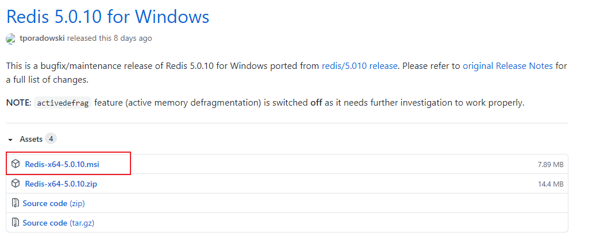
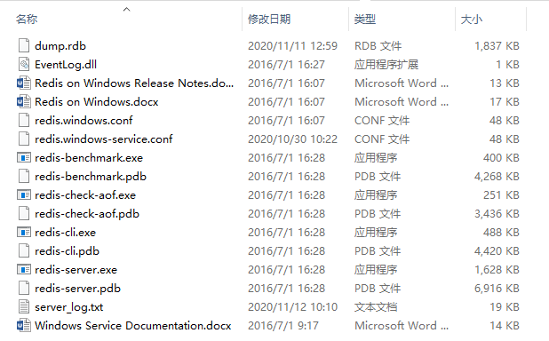
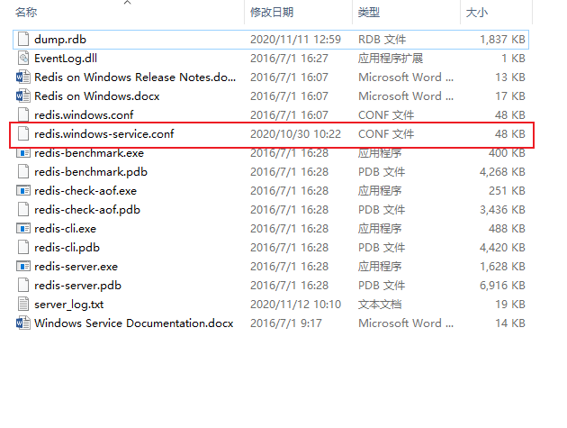
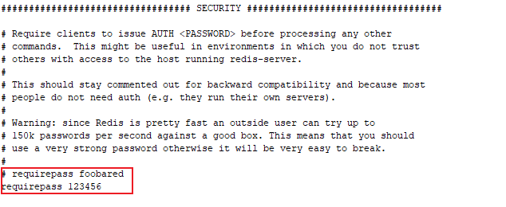
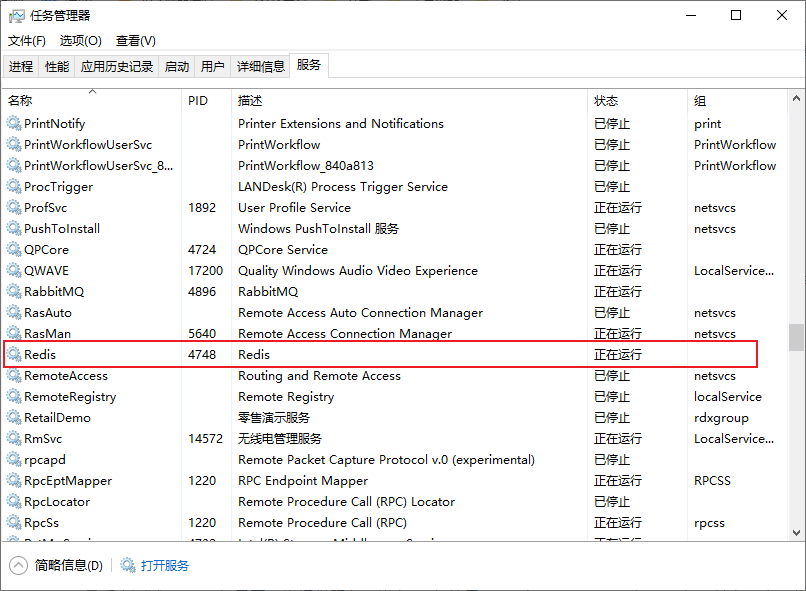
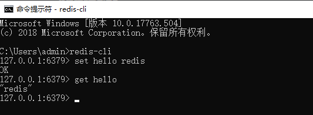

# Windows安装

## 下载Redis

**下载地址：**https://github.com/tporadowski/redis/releases。

Redis 支持 32 位和 64 位。这个需要根据你系统平台的实际情况选择，这里我们下载 **Redis-x64-xxx.msi**



打开msi文件开始安装，期间注意**勾选添加环境变量**，端口号可保持默认的6379，并选择防火墙例外，从而保证外部可以正常访问Redis服务

安装后的Redis根目录内容如下：



## 配置redis

打开Redis服务配置文件。通常为redis.windows-service.conf，而不是redis.windows.conf。后者是以非系统服务方式启动程序使用的配置文件



找到含有requirepass字样的地方，追加一行，输入requirepass 123456。这是访问Redis时所需的密码，一般测试情况下可以不用设定密码。



## 启动redis-server

打开任务管理器中的服务找到Redis，如果修改了配置文件需重启，显示正在运行则表示服务已启动



## 启动redis-client

打开 cmd 窗口，打开redis-client，输入`redis-cli`会以默认端口号6379连接本地Redis服务，若需连接远程Redis服务，则输入以下命令

```
redis-cli -h IP地址 -p 端口号
```

若设置了密码则需要密码授权登录

```
auth 密码
```

## 测试安装

设置键值对:

```
set hello redis
```

取出键值对:

```
get hello
```



# Unbuntu安装


# 管理指令

## 连接
连接本地Redis服务器 ：`redis-cli`

连接远程服务器的Redis服务器：`redis-cli -h host -p port -a password`

连接默认端口号：6379

如有密码输入密码登录：`auth password`

检测 redis 服务是否启动：`PING `


## 服务器配置

编辑配置：  `CONFIG SET CONFIG_SETTING_NAME NEW_CONFIG_VALUE`