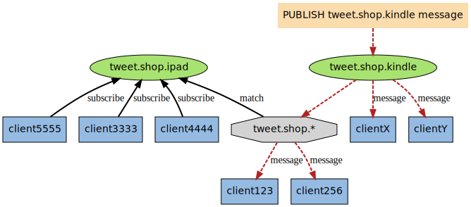

Redis 发布订阅 (pub/sub) 是一种**消息通信模式**：发送者 (pub) 发送消息，订阅者 (sub) 接收消息。

Redis提供了两种信息机制， 分别是`订阅/发布到频道`和`订阅/发布到模式`

# 订阅/发布到频道

## 概述

发布订阅通信模式示意图如下，Redis客户端可以订阅任意数量的频道，当有消息发布到该频道时会转发到所有订阅了该频道的订阅者处

## 命令

发布消息：`PUBLISH channel message`

订阅频道：`SUBSCRIBE channel [channel ...]`

退订：`UNSUBSCRIBE [channel [channel ...\]]`

查看订阅与发布系统状态信息：`PUBSUB subcommand [argument [argument ...\]]`

## 示例

# 订阅/发布到模式

## 概述

Redis支持订阅到某一模式，当订阅到某一模式时，发布消息到符合该模式的任意频道，订阅者都会收到消息

例如图中， `tweet.shop.*` 模式匹配了 `tweet.shop.kindle` 频道和 `tweet.shop.ipad` 频道。`client123`和`client256`订阅该模式，`clientX`和`clientY`订阅了`tweet.shop.kindle` 频道。当有信息发送到 `tweet.shop.kindle` 频道时， 信息除了发送给 `clientX` 和 `clientY` 之外， 还会发送给订阅 `tweet.shop.*` 模式的 `client123` 和 `client256` ：

## 命令

发布消息：`PUBLISH channel message`

订阅频道：`PSUBSCRIBE channel [channel ...]`

退订：`PUNSUBSCRIBE [channel [channel ...\]]`

查看订阅与发布系统状态信息：`PUBSUB subcommand [argument [argument ...\]]`

## 示例

使用subscribe不能订阅模式，如果使用subscribe订阅模式，`*`会认为是普通字符

