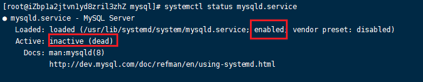
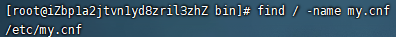
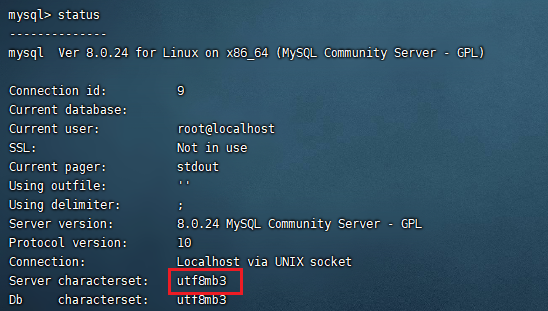

# CentOS安装

CentOS8安装mysql8

## 安装MySQL

### 检查是否安装过

```bash
systemctl status mysqld.service
# 输出Unit mysqld.service could not be found.
find / -name my.cnf
# 输出为空
```

若已安装过，或可能某步错误导致没走完整个步骤，见下面的卸载流程


### 下载mysql源安装包

在这里找到与自己系统版本一致的安装包https://dev.mysql.com/downloads/repo/yum/

```bash
wget https://dev.mysql.com/get/mysql80-community-release-el8-1.noarch.rpm
```

> 查看系统版本`uname -a`
>
> 
>
> 这里为8则选择Linux8


### 安装mysql源

```bash
yum localinstall  mysql80-community-release-el8-1.noarch.rpm
```

### 安装MySql

```bash
yum install mysql-community-server
```

> 出现以下报错的处理方式：
>
> 
>
> 先执行 `yum module disable mysql`
> 再执行`yum -y install mysql-community-server`

### 卸载Yum Repository

于每次 yum 操作都会自动更新，需要把这个卸载掉

```bash
yum -y remove mysql80-community-release-el8-1.noarch.rpm
```

## 配置MySQL

### 查看MySQL状态

```bash
systemctl status mysqld.service
```

下图为关闭状态



### 启动MySQL

```bash
systemctl start mysqld.service
```

### 登录MySQL

此时MySQL已经开始正常运行，不过想要登录MySQL还得先找出此时root用户的密码

```bash
grep "password" /var/log/mysqld.log
```


```bash
mysql -uroot –p  
# 输入上述查出来的随机密码
```

### 修改密码

密码设置必须包含大小写字母、数字和特殊字符，不然修改密码失败

```bash
ALTER USER 'root'@'localhost' IDENTIFIED BY '密码';
```

### 开启远程访问

#### Mysql开启远程访问

方式一：授权法

以下语句为允许某个IP使用root账号远程访问MySQL，若想使用root从任何主机连接到mysql服务器的话将IP替换为`%`

```bash
grant all privileges on *.* to 'root'@'192.168.1.64' identified by 'MySQL%57' with grant option;
```

方式二：改库

```bash
# 登录数据库，输入密码后完成登录
mysql -h localhost -u root -p 
# 选择 mysql 库
mysql> use mysql;
# 查询连接配置
mysql> select user,host from user; 
+------------------+-----------+
| user             | host      |
+------------------+-----------+
| mysql.infoschema | localhost |
| mysql.session    | localhost |
| mysql.sys        | localhost |
| root             | localhost |
+------------------+-----------+
4 rows in set (0.00 sec)

# 配置允许使用 root 账户进行远程登录
mysql> update user set host='%' where user='root';
# 刷新设置
mysql> flush privileges; 
```


#### 阿里云设置（云服务器必做）

在云服务器控制台中，配置安全组规则，添加3306入站规则


#### 防火墙添加端口（选做）

```bash
firewall-cmd --zone=public --add-port=3306/tcp --permanent
```

若上述语句提示未打开防火墙，则打开再执行

> 查看防火墙状态
>`systemctl status firewalld`
> 
> 打开/关闭防火墙
>`systemctl start firewalld`
> `systemctl stop firewalld`
> 
> 重启防火墙
>`systemctl restart firewalld`
> 
> 查看防火墙某个端口是否开放
>`firewall-cmd --query-port=3306/tcp`
> 
> 开放防火墙端口3306
>`firewall-cmd --zone=public --add-port=3306/tcp --permanent`
> 注意：开放端口后要重启防火墙生效
> 
> 关闭防火墙端口
>`firewall-cmd --remove-port=3306/tcp --permanent`

#### 测试远程访问

客户端使用下面语句远程连接

```bash
mysql -h localhost -u root -p 
```

若上述代码能连上，再使用可视化连接工具，如Navicat、WorkBench等，若可视化连接工具连接不上则为工具问题，与服务器配置无关。如：[Navicat连不上MYSQL问题](https://blog.csdn.net/CliffordR/article/details/89598087?ops_request_misc=%257B%2522request%255Fid%2522%253A%2522162026866116780255299561%2522%252C%2522scm%2522%253A%252220140713.130102334..%2522%257D&request_id=162026866116780255299561&biz_id=0&utm_medium=distribute.pc_search_result.none-task-blog-2~all~sobaiduend~default-1-89598087.nonecase&utm_term=navicat+mysql8)

### 配置开机自启动

```bash
systemctl enable mysqld
```

### 修改字符集

修改配置文件my.cnf

1. 查找my.cnf所在目录
   
   ```bash
   find / -name my.cnf
   ```

   

2. 打开文件，新增以下四行代码

   ```
   [client]
   default-character-set=utf8
   character-set-server=utf8
   collation-server=utf8_general_ci
   ```

3. 保存my.cnf后，重启MySQL

   ```bash
   systemctl restart mysqld.service
   ```

4. 登录MySQL，查看status，可以看到字符集编码已经成功修改为utf8

   

# CentOS卸载

1. 快速删除

```bash
yum remove  mysql mysql-server mysql-libs mysql-server
```

2. 查找残留文件

```bash
rpm -qa | grep -i mysql
# 将查询出来的文件删除
yum remove mysql-community-common-5.7.20-1.el6.x86_64
# 删除残余目录
whereis mysql
# mysql : /usr/lib64/mysql
rm –rf /usr/lib64/mysql
```

3. 删除依赖

```bash
# 查找依赖 
yum list installed | grep mysql
# 删除找到的依赖
yum -y remove mysql-libs.x86_64
```


