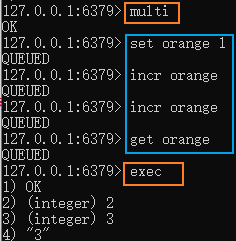
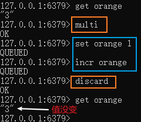

# Redis事务概述

## Redis事务是什么

Redis事务就是一次性、顺序性、排他性的执行一个队列中的一系列指令

## 与MYSQL数据库的区别

| Redis                                                        | Mysql                                                        |
| ------------------------------------------------------------ | ------------------------------------------------------------ |
| 默认不会开启事务，即指令会立即执行，而不会排队 不支持隔离级别的调整 指令执行错误其他指令仍然回被执行 不支持回滚 支持乐观锁 | 默认开启一个自动提交的事务，即每成功执行一次sql，一个事务就会马上提交 支持隔离级别的调整 执行错误自动回滚   |

> 在关系型数据库中，经常使用ACID来讨论事务，但是在非关系型数据库中是无意义的（因为没有这个概念），Redis实现的原子性只是要么都运行，要么都不运行。而不是Mysql的要么都正确运行，要么都不运行。对于一致性，Redis不存在这个概念，因为没有这个约束

## Redis事务三个阶段

- 开始事务

- 命令入队，没有实际执行

- 执行事务，顺序的一次执行

> 批量操作在发送 EXEC 命令前被放入队列缓存，并不会被实际执行
>
> 即事务内的查询看不到事务里的更新
>
> 事务外查询也不能看到事务里的更新

# Redis事务指令

| 指令                      | 详情                                                         |
| ------------------------- | ------------------------------------------------------------ |
| `watch key1 [key2 ...]`   | 监控一或多个key,如果在事务执行之前，被监视的key被其他命令改动，则事务被打断（乐观锁） |
| `multi`                   | 标记一个事务块的开始，之后的指令入队                         |
| `exec`                    | 执行所有事务块的命令，**释放所有监控锁**                     |
| `discard`                 | 取消事务，放弃事务块中的所有命令                             |
| `unwatch key1 [key2 ...]` | 取消监控                                                     |

## 一般事务的执行样例

| 正常执行                                                     | 取消事务                                                     |
| ------------------------------------------------------------ | ------------------------------------------------------------ |
|  |  |

## Watch的执行样例

`watch`指令类似于乐观锁，在事务提交时，如果`watch`监控的多个KEY中任何KEY的值已经被其他客户端更改，则使用`exec`执行事务时，事务队列将不会被执行，同时返回`Nullmulti-bulk`应答以通知调用者事务执行失败

**`watch`一定要在`multi`之前执行**

| 监听后未修改，执行成功                                       | 监听后修改，执行失败                                         |
| ------------------------------------------------------------ | ------------------------------------------------------------ |
|  |  |

## 错误对事务的影响

| 命令错误（输完会直接报错，不会显示QUEUED的错误）导致的错误会导致整个事务不执行 | 语法错误导致的错误只会影响有错误的指令，事务中的其他指令正常执行 |
| ------------------------------------------------------------ | ------------------------------------------------------------ |
|  |  |

