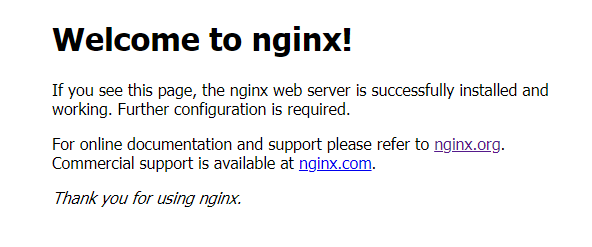

# 安装

## 安装准备

安装编译工具及库文件（安装过可跳过这一步）

- **make / gcc-c++**： 编译使用
- **zlib / zlib-devel**： nginx中gzip使用
- **openssl / openssl-devel**： openssl是web安全通信的基石，nginx支持 https使用（即在ssl协议上传输http）

```
yum -y install make zlib zlib-devel gcc-c++ openssl openssl-devel libtool
```

## 安装 PCRE

PCRE 作用是让 Nginx 支持 Rewrite 功能

```
yum install -y pcre pcre-devel
```

## 安装 Nginx

### 下载 Nginx

在http://nginx.org/里找个最新稳定版下载


例如1.20版本的下载地址为： http://nginx.org/download/nginx-1.20.0.tar.gz

创建nginx目录，使用wget下载源码包

```
wget http://nginx.org/download/nginx-1.20.0.tar.gz
```

### 解压安装包

```
tar -zxvf nginx-1.20.0.tar.gz
```


### 编译安装

使用./configure设置安装细节：

- 指定编译安装目录： `--prefix=你的安装路径`
- 监控模块： `--with-http_stub_status_module`
- SSL模块： `--with-http_ssl_module`模块

```
cd nginx-1.18.0

# 安装设置
./configure --prefix=/usr/local/soft/nginx --with-http_stub_status_module --with-http_ssl_module 

# 编译
make 

# 安装
make install
```

## 安全配置开启

在服务端使用wget和curl测试下返回的是否正常，若正常，则可跳过

```
wget 127.0.0.1
curl 127.0.0.1 # 云服务器可尝试用IP
```

通过127.0.0.1访问正常则说明nginx正常启动着


通过IP访问连接超时，可能由于防火墙打开但没有配置端口，或云服务器安全组未配置端口导致


### 防火墙

如果打开了防火墙，则需配置80端口的准入

```
# 添加80端口
firewall-cmd --zone=public --add-port=80/tcp --permanent

# 重新载入
firewall-cmd --reload
```


PS：到这一步wget不一定能访问，若为云服务器则还需配置安全组

### 云服务器安全组配置（云服务器专属配置）

云服务器安全组规则中配置80端口的访问权限


## 验证安装

查看nginx版本来验证是否安装成功：

```
cd nginx安装目录/sbin

# 执行查看版本命令
./nginx -v

# 开启nginx
./nginx
# 查看nginx运行状态
ps -ef | grep nginx
```

在客户端打开浏览器使用IP访问



若不能访问见教程排查：https://www.cnblogs.com/achengmu/p/9093981.html

## 配置systemctl 管理(选做)

1. 编辑systemctl服务配置文件

```
vim /usr/lib/systemd/system/nginx.service
```

2. 内容如下
   注意更改nginx`启动命令`、`nginx.conf`、`nginx.pid`的路径

```
[Unit]
Description=nginx  web server
Documentation=http://nginx.org/en/docs/
After=network.target remote-fs.target nss-lookup.target

[Service]
Type=forking
PIDFile=/usr/local/soft/nginx/logs/nginx.pid
ExecStartPre=/usr/local/soft/nginx/sbin/nginx -t -c /usr/local/soft/nginx/conf/nginx.conf
ExecStart=/usr/local/soft/nginx/sbin/nginx -c /usr/local/soft/nginx/conf/nginx.conf
ExecReload=/bin/kill -s HUP $MAINPID
ExecStop=/bin/kill -s QUIT $MAINPID
PrivateTmp=true

[Install]
WantedBy=multi-user.target
```

3. 重载系统服务

```
systemctl daemon-reload
```

4. 启动nginx (启动前，记得把之前的先关闭)

```
systemctl start nginx
systemctl status nginx
```

5. 设置开机启动

```
systemctl enable nginx
systemctl is-enabled nginx
```

# 卸载

全局查找nginx相关的文件：

```
find / -name nginx*
若报错用这个
find / -name "nginx*"
```

删除查出来的所有文件

```
rm -rf 查出来的文件路径
```


# 附录1：安装时configure支持的配置选项

`--prefix = path` ：配置编译后文件存放的路径，默认使用`/usr/local/nginx`，<u>推荐使用默认</u>

`--sbin-path = path`：配置编译后可执行文件的路径，默认使用`prefix/sbin/nginx`，<u>推荐使用默认</u>

`--conf-path = path`：设置编译之后的conf文件的路径，默认是用`prefix/conf/nginx.conf`，<u>推荐使用默认</u>

`--pid-path = path`：配置`nginx.pid`文件（启动时生成的文件）存放的目录，默认是存放在`prefix/logs/nginx.pid`，<u>不推荐使用默认路径</u>，因为logs主要用于存放日志文件，这种情况下容易误删除，建议存放在`prefix/nginx.pid`目录下

`--error-log-path = path`：配置错误日志文件的路径，默认路径为`prefix/logs/error.log`，在配置之后可以在`nginx.conf`中修改，在执行configure的时候<u>可以忽略</u>

`--http-log-path = path`：配置服务器访问日志路径，默认路径为`prefix/logs/access.log`，在配置之后可以在`nginx.conf`中修改，在执行configure的时候<u>可以忽略</u>

`--build = name`：设置nginx的编译的名字，<u>建议忽略该选项</u>

`--user = name` ：设置`worker`线程的linux用户信息，可以控制`worker`线程的权限，默认用户名为`nobody`，在配置之后可以在`nginx.conf`中修改，<u>推荐使用默认</u>

`--group = name`：同上，设置`worker`线程的linux用户分组，可以控制`worker`线程的权限，<u>推荐使用默认</u>

`--with-select_module`/`--without-select_module` ：配置服务器是否使用`select轮询接口`（该接口低效且有限制），在编译过程中默认首先使用高效的`epoll`、`poll`等机制，<u>推荐使用默认</u>

`--with-poll_module`/`--without-poll_module`：同上，`poll`接口比`select`接口更加高效，但是同样有一定的socket数量的限制，<u>推荐使用默认</u>

`--without-http_gzip_module` ：禁止服务器使用zip压缩传输数据，<u>忽略该选项</u>

`--without-http_rewrite_module`：禁止URL重写，<u>如果需要URL重写，忽略该选项</u>

`--without-http_proxy_module`：禁止代理模块，<u>如果需要代理，忽略该选项</u>

`--with-http_ssl_module`：开启SSL，<u>如果不需要SSL，忽略该选项</u>

`--with-pcre = path`：配置pcre库的源文件的路径，如果需要url重写或者是location正则匹配，那么需要配置该选项

`--with-zlib = path`：配置zlib压缩库源文件的路径，如果需要数据传输压缩，那么需要配置该选项

`--with-cc-opt = parameters`：该配置是用于扩展gcc编译配置，根据操作系统不同需要进行配置。

`--with-ld-opt = parameters`：如果在FreeBSD操作系统下面配置PCRE，那么需要配置该选项

其他配置选项见：http://nginx.org/en/docs/configure.html

# 附录2：nginx 的模块清单

## 核心模块

- ngx_core
- ngx_errlog
- ngx_conf
- ngx_events
- ngx_event_core
- ngx_epll
- ngx_regex

## 标准 HTTP 模块

- ngx_http
- ngx_http_core             #配置端口，URI 分析，服务器相应错误处理，别名控制 (alias) 等
- ngx_http_log              #自定义 access 日志
- ngx_http_upstream         #定义一组服务器，可以接受来自 proxy, Fastcgi,Memcache 的重定向；主要用作[负载均衡](https://cloud.tencent.com/product/clb?from=10680)
- ngx_http_static
- ngx_http_autoindex        #自动生成目录列表
- ngx_http_index            #处理以`/`结尾的请求，如果没有找到 index 页，则看是否开启了`random_index`；如开启，则用之，否则用 autoindex
- ngx_http_auth_basic       #基于 http 的身份认证 (auth_basic)
- ngx_http_access           #基于 IP 地址的访问控制 (deny,allow)
- ngx_http_limit_conn       #限制来自客户端的连接的响应和处理速率
- ngx_http_limit_req        #限制来自客户端的请求的响应和处理速率
- ngx_http_geo
- ngx_http_map              #创建任意的键值对变量
- ngx_http_split_clients
- ngx_http_referer          #过滤 HTTP 头中 Referer 为空的对象
- ngx_http_rewrite          #通过正则表达式重定向请求
- ngx_http_proxy
- ngx_http_fastcgi          #支持 fastcgi
- ngx_http_uwsgi
- ngx_http_scgi
- ngx_http_memcached
- ngx_http_empty_gif        #从内存创建一个 1×1 的透明 gif 图片，可以快速调用
- ngx_http_browser          #解析 http 请求头部的 User-Agent 值
- ngx_http_charset          #指定网页编码
- ngx_http_upstream_ip_hash
- ngx_http_upstream_least_conn
- ngx_http_upstream_keepalive
- ngx_http_write_filter
- ngx_http_header_filter
- ngx_http_chunked_filter
- ngx_http_range_header
- ngx_http_gzip_filter
- ngx_http_postpone_filter
- ngx_http_ssi_filter
- ngx_http_charset_filter
- ngx_http_userid_filter
- ngx_http_headers_filter   #设置 http 响应头
- ngx_http_copy_filter
- ngx_http_range_body_filter
- ngx_http_not_modified_filter

## 可选 HTTP 模块

- ngx_http_addition         #在响应请求的页面开始或者结尾添加文本信息
- ngx_http_degradation      #在低内存的情况下允许服务器返回 444 或者 204 错误
- ngx_http_perl
- ngx_http_flv              #支持将 Flash 多媒体信息按照流文件传输，可以根据客户端指定的开始位置返回 Flash
- ngx_http_geoip            #支持解析基于 GeoIP 数据库的客户端请求
- ngx_google_perftools
- ngx_http_gzip             #gzip 压缩请求的响应
- ngx_http_gzip_static      #搜索并使用预压缩的以.gz 为后缀的文件代替一般文件响应客户端请求
- ngx_http_image_filter     #支持改变 png，jpeg，gif 图片的尺寸和旋转方向
- ngx_http_mp4              #支持.mp4,.m4v,.m4a 等多媒体信息按照流文件传输，常与 ngx_http_flv 一起使用
- ngx_http_random_index     #当收到 / 结尾的请求时，在指定目录下随机选择一个文件作为 index
- ngx_http_secure_link      #支持对请求链接的有效性检查
- ngx_http_ssl              #支持 https
- ngx_http_stub_status
- ngx_http_sub_module       #使用指定的字符串替换响应中的信息
- ngx_http_dav              #支持 HTTP 和 WebDAV 协议中的 PUT/DELETE/MKCOL/COPY/MOVE 方法
- ngx_http_xslt             #将 XML 响应信息使用 XSLT 进行转换

## 邮件服务模块

- ngx_mail_core
- ngx_mail_pop3
- ngx_mail_imap
- ngx_mail_smtp
- ngx_mail_auth_http
- ngx_mail_proxy
- ngx_mail_ssl

## 第三方模块

- echo-nginx-module         #支持在 nginx 配置文件中使用 echo/sleep/time/exec 等类 Shell 命令
- memc-nginx-module
- rds-json-nginx-module     #使 nginx 支持 json 数据的处理
- lua-nginx-module