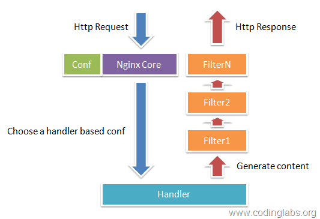

# 工作原理

Nginx由<u>内核</u>和<u>模块</u>组成

当它接到一个HTTP请求时，Nginx本身做的工作实际很少，它仅仅是通过查找配置文件将此次请求映射到一个`Server块`中的`Location块`，而此`Location块`中所配置的各个指令则会启动不同的模块去完成工作，因此**模块**可以看做Nginx真正的劳动工作者

通常一个`Location块`中的指令会涉及一个`handler模块`和多个`filter模块`。`handler模块`负责处理请求，完成响应内容的生成，而`filter模块`对响应内容进行处理

> **Nginx的模块<u>从结构上</u>分为：**
>
> - 核心模块：HTTP模块、EVENT模块和MAIL模块
> - 基础模块：HTTP Access模块、HTTP FastCGI模块、HTTP Proxy模块和HTTP Rewrite模块
> - 第三方模块：HTTP Upstream Request Hash模块、Notice模块和HTTP Access Key模块
>
> **用户根据自己的需要开发的模块都属于第三方模块。正是有了这么多模块的支撑，Nginx的功能才会如此强大**
>
> **Nginx的模块<u>从功能上</u>分为：**
>
> - Handlers（处理器模块）：此类模块直接处理请求，并进行输出内容和修改headers信息等操作。Handlers处理器模块一般只能有一个
> - Filters （过滤器模块）：此类模块主要对其他处理器模块输出的内容进行修改操作，最后由Nginx输出
> - Proxies （代理类模块）：此类模块是Nginx的HTTP Upstream之类的模块，这些模块主要与后端一些服务比如FastCGI等进行交互，实现服务代理和负载均衡等功能

# 进程模型

Nginx默认采用多进程工作方式，Nginx启动后，会运行一个`master进程`和多个`worker进程`：

- `master进程`：充当整个进程组与用户的交互接口，同时对进程进行监护，管理worker进程来实现重启服务、平滑升级、更换日志文件、配置文件实时生效等功能
- `worker进程`：用来处理基本的网络事件，worker之间是平等的，他们共同**竞争**来处理来自客户端的请求

这个进程模型使得Nginx可热部署

# 处理流程及细节

Nginx支持多种连接处理方式，具体使用哪一种由当前平台决定，一般为`Epoll方式`，说原理的时候一般分析`Epoll方式`。Nginx的Epoll工作流程如下：

1. `master 进程`接受到信号（如nginx -s reload）后启动，读取配置文件，建好需要监听的`socket`后，然后再`fork`出多个`woker进程`，这样每个`work进程`都可以去`accept`这个`socket`
2. 当一个`client连接`到来时，所有`accept`的`work进程`都会受到通知，但只有一个进程可以accept成功，其它的则会accept失败（防止惊群现象）
3. 当一个`worker进程` `accept`这个连接后，就开始读取请求，解析请求，处理请求，产生数据后，再返回给客户端，最后才断开连接，这样一个完成的请求就结束了（异步非阻塞方式）

## 连接处理方式

nginx支持多种连接处理方式，具体使用哪一种由当前平台决定。如果当前平台支持多种方式，<u>nginx会自动选择最佳的方式</u>。在有需要的情况下，可以通过`use命令`来指定连接处理方式

- select方式：一种标准方式。当不存更为高效的方式时会使用`select-module`进行编译构建。使用`–with-select_module 和 --without-select_module`可以显式使用/禁止使用模块
- poll方式：一种标准方式。当不存更为高效的方式时会使用`poll-module`进行编译构建。使用`–with-poll_module 和 --without-poll_module`可以显式使用/禁止使用模块
- kqueue方式：一种高效方式。应用于FreeBSD 4.1+, OpenBSD 2.9+, NetBSD 2.0, and macOS
- **epoll方式**：一种高效方式。应用于Linux 2.6+
- /dev/poll方式：一种高效方式。应用于Solaris 7 11/99+, HP/UX 11.22+ (eventport), IRIX 6.5.15+, and Tru64 UNIX 5.1A+
- eventport方式：基于事件端口的一种方式，应用于Solaris 10+（由于一些明显缺陷，推荐使用/dev/poll替代）

> apache 采用的select模型；nginx采用epoll模型
>
> nginx 处理请求是异步非阻塞的，而apache则是阻塞型的，在高并发下nginx 能保持低资源低消耗高性能

### Epoll方式：异步/非阻塞/事件驱动

**场景**：大量请求来了，大多需要读写数据发生IO请求或需要等待结果，此时程序会发生中断，这个时候这个进程怎么办

- 阻塞方案：这个进程啥也不干了，坐等IO请求完
- 非阻塞方案：这个进程先干别的，时不时看看IO请求完了没，请求完再回来处理这个请求

**Nginx解决**：利用Linux的Epoll模型异步非阻塞方式处理请求

每个worker里面只有一个主线程，但一个worker可以同时处理多个请求。每个请求进来，worker线程将其注册处理转发给下游服务后，并不是挂起等待，而是切换处理别的请求。采用这种轮询的方式来并发处理大量请求

比如：同时有多个http request的时候，worker主线程与第一条request建议连接将其处理转发给下游tomcat服务器后，并不会挂起等待，而是立马处理下一条，可以理解轮询处理。与多线程相比，这种事件处理方式是有很大的优势的，不需要创建线程，每个请求占用的内存也很少，没有上下文切换，事件处理非常的轻量级。并发数再多也不会导致无谓的资源浪费（上下文切换），更多的并发数，只是会占用更多的内存而已。因此nginx 是非常适合处理高并发请求的

**优点：**只要设置好Worker进程个数与CPU的亲缘性绑定，那么就能减少CPU在进程间切换所花费的时间以及切换带来的进程的保存/恢复现场，同时，由于Nginx中一个worker里面只有一个线程，也避免了线程的上下文切换

**PS：**<u>worker进程数目建议设为与cpu核数相同</u>，这样每个worker进程都绑定特定的CPU核心，进程间切换的代价是最小的。因为一是Nginx一般做的是高并发代理，基本没有IO操作，大多数都是CPU密集型操作，很少出现IO阻塞等情况。二是进程与CPU调度的关系，单个核心处理多个进程的时候，是排队处理的，如果设置多个进程的时候，是排队处理的，如果设置多个进程时，会带来进程间切换的开销

> EPOLL模型，提供一种事件驱动机制，它可以监控多个事件是否准备好了，如果准备好了，那么就放入EPOLL队列中。这种机制是异步的。通过这样，WORKER进程只需要循环处理EPOLL队列中的请求，我们只需要在请求间不断切换，而这种切换是不需要付出什么代价的，通过这种循环处理已经准备好的请求，从而Nginx可以高效的处理高并发的问题
>

## 惊群现象处理

**惊群现象**：在创建`master进`程时，先建立需要监听的`socket(listenfd)`，然后从`master进程`中`fork()`出多个`worker进程`，如此一来每个`worker进程`都可以监听用户请求的`socket`。一般来说，当一个连接进来后，所有在Worker都会收到通知，但是只有一个进程可以接受这个连接请求，其它的都失败

**Ngnix的解决**：nginx提供了一个`accept_mutex(互斥锁)`，有了这把锁之后，同一时刻，就只会有一个进程在`accpet连接`

> 惊群效应：当你往一群鸽子中间扔一块食物，虽然最终只有一个鸽子抢到食物，但所有鸽子都会被惊动来争夺，没有抢到食物的鸽子只好回去继续睡觉， 等待下一块食物到来。这样，每扔一块食物，都会惊动所有的鸽子
>
> 惊群资料：https://blog.csdn.net/second60/article/details/81252106

## 连接控制

**进程之间的数量平衡控制：**保证不会一个进程累死，其他进程在歇着

nginx使用一个叫`ngx_accept_disabled`的变量来控制是否去竞争`accept_mutex锁``
``ngx_accept_disabled = nginx单进程的所有连接总数 / 8 -空闲连接数量`

当`ngx_accept_disabled > 0`时，不会去尝试获取`accept_mutex锁`，`ngx_accept_disable`越大，于是让出的机会就越多，这样其它进程获取锁的机会也就越大。不去accept，每个worker进程的连接数就控制下来了，其它进程的连接池就会得到利用，这样，nginx就控制了多进程间连接的平衡

**一个进程的数量控制：**每个worker进程都有一个独立的连接池，连接池的大小是`worker_connections`

这里的连接池里面保存的其实不是真实的连接，它只是一个`worker_connections`大小的一个`ngx_connection_t结构的数组`。并且，nginx会通过一个链表`free_connections`来保存所有的空闲`ngx_connection_t`，每次获取一个连接时，就从空闲连接链表中获取一个，用完后，再放回空闲连接链表里面。

一个nginx能建立的最大连接数，应该是`worker_connections * worker_processes`。当然，这里说的是最大连接数：

- 对于HTTP请求本地资源来说，能够支持的最大并发数量是`worker_connections * worker_processes`
- 对于HTTP作为反向代理来说，最大并发数量应该是worker_connections * worker_processes/2。因为作为反向代理服务器，每个并发会建立与客户端的连接和与后端服务的连接，会占用两个连接

参考：

https://www.cnblogs.com/xiangsikai/p/8438772.html

https://www.jianshu.com/p/c1c62e1af266

https://zhuanlan.zhihu.com/p/167949133

