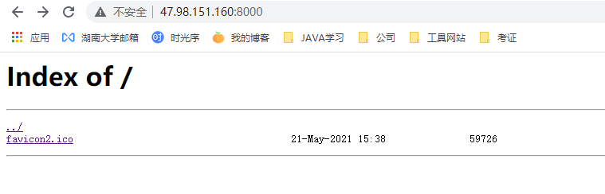
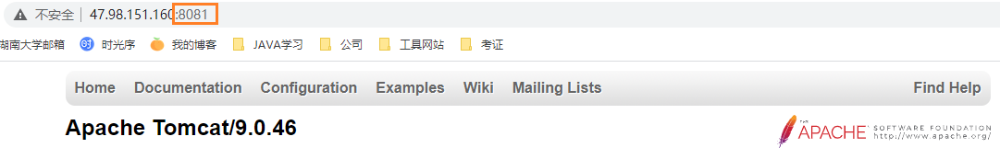
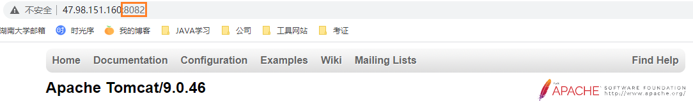

# 实现注意点

1. 以下实例配置后，需检查配置文件，再重启`nginx服务`，指令如下：

   ```bash
   # 检查nginx配置文件是否正确
   nginx -t
   
   # 平滑重启nginx服务
   nginx -s reload
   ```

   

2. 当无法实现效果时，不要慌张，可打开`nginx`服务日志（路径为`nginx根目录/logs`）查看报错信息

3. 注意配置的虚拟服务器端口是否开通访问权限（云服务器安全组、防火墙等）

4. 以下例子nginx服务器和tomcat服务器为同一台机器，所以写地址都写了127.0.0.1，请灵活参考

# 简单文件服务器配置

## 实现效果

将服务器`/home/nginx/share/public/`目录下的文件通过`nginx`提供给外部访问



## 准备工作

创建共享目录，并授权

```javascript
mkdir /home/nginx/share/public/
chmod 777 -R /home/nginx/share/public/
```

## 配置nginx

打开`nginx.conf`配置`server`

```javascript
server {	
    # 监听 8000 端口	
    listen 8000;
    server_name localhost;
    location / {	
        # 打开自动列表功能、显示文件大小、创建时间，通常关闭	
        autoindex on;	
        autoindex_exact_size on;
        autoindex_localtime on;
        # 将 / 路径映射至 /home/nginx/share/public/
        alias /home/nginx/share/public/;	
    }	
}
```

> 注意此处权限问题：
>
> 1. 8000端口权限：防火墙、云服务器安全组是否开启8000端口权限
>
> 2. `nginx`进程是否有访问共享目录`/home/nginx/share/public/`的权限
>
>    `nginx`进程权限取决于运行nginx用户的权限，即全局块配置的`user 用户名`配置，未配置事使用`nobody`，可配置为`root`或为`nginx`专门创建的用户（我使用了专门创建的用户，用户名为`nginx`）

# Nginx正向代理

## 准备工作

在http客户端配置代理服务器为Nginx服务器地址

linux

```
export http_proxy=Nginx服务器地址
export https_proxy=Nginx服务器地址

# 取消该设置
unset http_proxy
unset https_proxy
```

windows

浏览器配置HTTP代理

## 配置nginx

```
server {
    # DNS解析服务器IP地址，外网写8.8.8.8
    resolver 114.114.114.114;
    resolver_timeout 5s;
    listen 0.0.0.0:8080
    location / {
        proxy_pass http://$http_host$request_uri;
        proxy_set_header Host $http_host;
        proxy_buffers 256 4k;
        proxy_max_temp_file_size 0;
        proxy_connect_timeout 30;
        proxy_cache_valid 200 302 10m;
        proxy_cache_valid 301 1h;
        proxy_cache_valid any 1m;
    }
```

#  Nginx反向代理 

## 根据访问端口跳转

### 实现效果

使用 nginx 反向代理，根据访问的端口跳转到服务器的`tomcat`主页面中（Nginx默认安装完跳转到了Nginx Html文件）

效果如下：其实访问的是47.98.151.160:80，默认安装时以这个地址访问将展示Nginx欢迎页面，现展示为Tomcat欢迎页面


### 准备工作

准备一个tomcat，可通过8080访问


### 配置nginx

```
server {
    listen 80;
    server_name localhost;
    location / {
        proxy_pass http://127.0.0.1:8080;
        index index.html index.htm;
    }
}
```


## 根据访问路径跳转

### 实现效果
使用 nginx 反向代理，根据访问的路径跳转到不同端口的服务中。nginx 监听端口为`80`，
访问 http://47.98.151.160/server1 直接跳转到 47.98.151.160:8081
访问 http://47.98.151.160/server2 直接跳转到 47.98.151.160:8082

效果图如下：


### 准备工作

1. **准备两个 tomcat，一个 8081 端口，一个 8082 端口**

   (1) 将tomcat压缩包解压两份，一个重命名为`tomcat8081`一个重命名为`tomcat8082`

   (2) 编辑两台服务器的端口号，修改`/conf/server.xml`文件

   ​     `tomcat8081`：修改`http协议(8080->8081)`默认端口

   ​     `tomcat8082`：修改`server(8005->8091)`、`http协议(8080->8082)` 、`ajp协议(8009->9001)`的默认端口

   ​      

   ​      

   ​      

   (3) 启动两个tomcat，执行`/bin/startup.sh`

   (4) 访问两个tomcat

   

   

2. **准备两个不同的测试的页面以区分访问的Tomcat服务器**
   写一个`hello.html`页面
   放到`tomcat8081`的目录`/webapps/server1` 下，内容：

   ```
   <h1>hello,tomcat-8081</h1>
   ```

   放到`tomcat8082`的目录`/webapps/server2` 下，内容：

   ```
   <h1>hello,tomcat-8082</h1>
   ```

   访问测试下

   

   

   

### 配置nginx

```
server {
    listen 80;
    server_name localhost;
    
    location ~ /server1/ {
        proxy_pass http://127.0.0.1:8081;
    }
    
    location ~ /server2/ {
        proxy_pass http://127.0.0.1:8082;
    }
}
```

#  Nginx 动静分离

## 什么是动静分离

Nginx 动静分离简单来说就是把动态跟静态请求分开，不能理解成只是单纯的把动态页面和静态页面物理分离。严格意义上说应该是 动态请求 跟 静态请求 分开，可以理解成使用 Nginx 处理静态页面，Tomcat 处理动态页面


动静分离从目前实现角度来讲大致分为两种：

- 一种是纯粹把静态文件独立成单独的域名，放在独立的服务器上，可使用CDN技术，也是目前主流推崇的方案

- 一种方法就是动态跟静态文件混合在一起发布，通过 nginx 来分开


通过 location 指定不同的后缀名实现不同的请求转发。通过 expires 参数设置，可以使浏览器缓存过期时间，减少与服务器之前的请求和流量

## 实现效果

就是简单文件服务器+反向代理

访问 http://47.98.151.160/www/hello.html 走Tomcat服务器

访问 http://47.98.151.160/image/ 走跳转到静态文件列表

## 配置nginx

见简单文件服务器配置+Nginx反向代理-根据访问路径跳转的配置

# Nginx负载均衡

## 实现效果
浏览器地址栏输入地址 http://47.98.151.160/home/hello.html，负载均衡效果，平均 8081 和 8082 两台tomcat中


## 准备工作

1. **准备两台Tomcat服务器**，同 Nginx反向代理-根据访问路径跳转-准备工作 配置两台服务器

2. **准备两个不同的测试的页面以区分访问的Tomcat服务器**

   写一个`hello.html`页面
   放到`tomcat8081`的目录 `/webapps/home` 下，内容：

   ```
   <h1>hello,tomcat-8081</h1>
   ```

   放到`tomcat8082`的目录 `/webapps/home` 下，内容：

   ```
   <h1>hello,tomcat-8082</h1>
   ```

## 配置nginx

配置项：

1. 负载均衡服务器集合：`upstram`
2. 负载均衡策略：这里没有配置均衡策略，即使用的是默认负载均衡策略：轮询。nginx还支持其他策略
3. 走负载均衡的请求：`location`


    upstream myserver {
        server 47.98.151.160:8081;
        server 47.98.151.160:8082;
    }
    server {
        listen       80;
        server_name  47.98.151.160;
        location / {
            proxy_pass   http://myserver;
    }

### 负载均衡策略

负载均衡即是将负载分摊到不同的服务单元，可降低单个服务器的负载压力

负载均衡策略即按某一策略将请求分发到具体服务器

#### 轮询（默认）
每个请求按时间顺序逐一分配到不同的服务器，如果后端服务器挂掉，能自动剔除

#### 加权轮询

weight 代表权重, 默认为 1,权重越高被分配的客户端越多

    upstream myserver {
        server 47.98.151.160:8081 weight=10; 
        server 47.98.151.160:8082 weight=10;
    }

#### ip_hash

ip_hash 每个请求按访问 ip 的 hash 结果分配，这样每个访客固定访问一个后端服务器

    upstream myserver {
    	ip_hash;				
        server 47.98.151.160:8081;   
        server 47.98.151.160:8081;
    }

#### fair（第三方）

fair（第三方），按后端服务器的响应时间来分配请求，响应时间短的优先分配。

    upstream myserver {	
        fair; 										
        server 47.98.151.160:8081;   
        server 47.98.151.160:8081;	
    }

# Nginx缓存(未完成)

## 实现效果

## 准备工作

创建共享目录，并授权，放一个图片进去

```javascript
mkdir /home/nginx/share/public/image
chmod 777 -R /home/nginx/share/public/
```

## 配置nginx

缓存涉及以下配置：

1. 缓存文件放在哪儿？

   `proxy_cache_path`：指定缓存位置、缓存名称、内存中缓存内容元数据信息大小限制、缓存总大小限制。缓存位置是一个目录应该先创建好，nginx并不会帮我们创建这个缓存目录

   `proxy_cache`：指定使用前面设置的缓存名称

2. 如何指定哪些请求被缓存？
   `proxy_cache_key`：自定义缓存key，Nginx默认会缓存所有get和head方法的请求结果，缓存的key默认使用请求字符串

   `proxy_cache_min_uses`：指定请求至少被发送了多少次以上时才缓存，可以防止低频请求被缓存

   `proxy_cache_methods`：指定缓存的请求方式如：GET、POST

3. 缓存的有效期是多久？

   默认情况下，缓存的内容是长期存留的，除非缓存的总量超出限制。可以指定缓存的有效期

   `proxy_cache_valid`：指定有效期，例如：

   ​               `proxy_cache_valid 200 302 10m;`响应状态码为200 302时，10分钟有效 
   ​               `proxy_cache_valid any 5m;`对应任何状态码，5分钟有效 

4. 如何指定哪些请求不被缓存？

   `proxy_cache_bypass`：指定请求响应来自原始服务器而不是缓存

> **网页缓存**由HTTP消息头中的`Cache-control`来控制的
> 常见的取值有private、no-cache、max-age、must-revalidate等，默认为private。
> 
> 其作用根据不同的重新浏览方式分为以下几种情况
>
> | Cache-directive                     | 说明                                                         |
> | ----------------------------------- | ------------------------------------------------------------ |
> | public                              | 所有内容都将被缓存（客户端和代理服务器都可缓存）             |
> | private                             | 内容只缓存到私有缓存中（仅客户端可以缓存，代理服务器不可缓存） |
> | no-cache                            | 必须先与服务器确认返回的响应是否被更改，然后才能使用该响应来满足后续对同一个网址的请求。<br />no-cache会发起往返通信来验证缓存的响应，如果资源未被更改，可以避免下载 |
> | no-store                            | 所有内容都不会被缓存到缓存或Internet临时文件中               |
> | must-revalidationproxy-revalidation | 如果缓存内容失败，请求必须发送到服务器、代理以进行重新验证   |
> | max-age=xxx                         | 缓存的内容将在xxx秒失效，这个选项只在HTTP 1.1可用，并如果和`Last-Modified`一起使用时，优先级较高 |

配置示例：

```
http {
    proxy_cache_path /home/nginx/cache  keys_zone=one:10m  max_size=10g;
    server {
        listen       80;
        proxy_cache  one;
        server_name  aidan.org;
        location / {
            proxy_pass  http://aidan.org;
            expires 10m;
            proxy_cache_valid any 5m;
            add_header Cache-Control "public";
            add_header X-proxy-Cache $upstream_cache_status;
        }
    }
}
```

# Nginx集群(未完成)


参考：

https://blog.csdn.net/qq_40036754/article/details/102463099?ops_request_misc=%257B%2522request%255Fid%2522%253A%2522162199566116780265480863%2522%252C%2522scm%2522%253A%252220140713.130102334..%2522%257D&request_id=162199566116780265480863&biz_id=0&utm_medium=distribute.pc_search_result.none-task-blog-2~all~top_positive~default-2-102463099.pc_search_result_no_baidu_js&utm_term=nginx&spm=1018.2226.3001.4187

https://blog.csdn.net/h13140995776/article/details/101174283?utm_medium=distribute.pc_relevant.none-task-blog-2%7Edefault%7EBlogCommendFromMachineLearnPai2%7Edefault-2.control&depth_1-utm_source=distribute.pc_relevant.none-task-blog-2%7Edefault%7EBlogCommendFromMachineLearnPai2%7Edefault-2.control