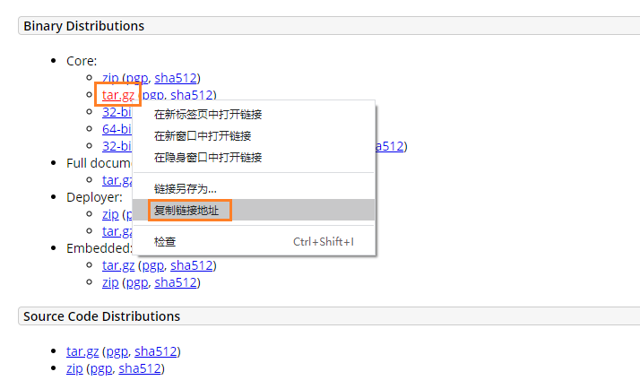

# CentOS安装

## 下载Tomcat

访问Tomcat下载地址：https://tomcat.apache.org/download-90.cgi

按下图所示，获取下载链接；或下载后上传至服务器安装



## 解压压缩包

```
 # 解压缩
 tar -zxv -f apache-tomcat-9.0.46.tar.gz
 
 # 重命名文件夹
 mv apache-tomcat-9.0.46 tomcat
 
 # 删除压缩包
 rm apache-tomcat-9.0.46.tar.gz
```

## 启动服务

```
#启动tomcat
/usr/local/soft/tomcat/bin/startup.sh
```

访问服务器：`IP:8080`（8080为默认端口）

此处注意端口权限开通（云服务器安全组、防火墙等）


 ## 设置管理员账号密码（选做）

当需要使用界面的APP管理功能时，需设置管理员账号密码。默认是没有设置的


1. 打开tomcat目录下的管理用户的文件 `tomcat根目录/conf/tomcat-users.xml`，添加如下内容：

   ```
   <role rolename="admin-gui"/>  
   <role rolename="manager-gui"/>
   <user username="tomcat" password="admin" roles="manager-gui,admin-gui"/>
   ```

2. 重启tomcat

   ```
   # 关闭服务
   bin/shutdown.sh
   # 开启服务
   bin/startup.sh
   ```

   

