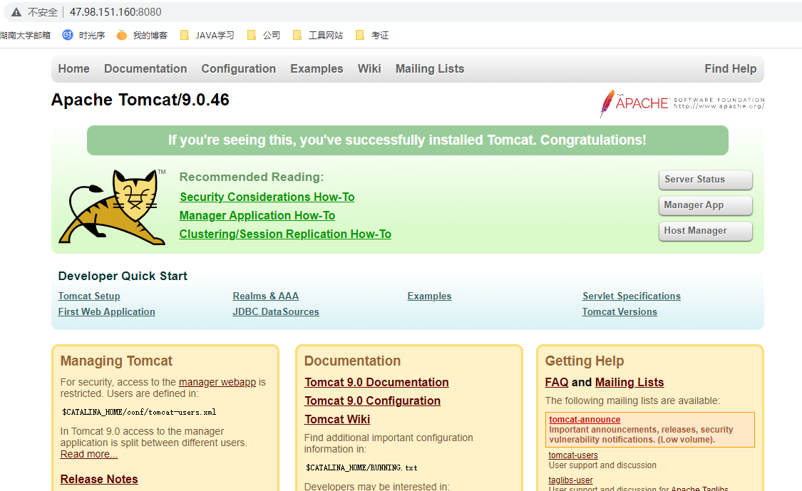

# 安装须知

安装Tomcat前需安装JDK并配置好环境变量

# CentOS安装

## 下载Tomcat

访问Tomcat下载地址：https://tomcat.apache.org/download-90.cgi

按下图所示，获取下载链接；或下载后上传至服务器安装


## 解压压缩包

```
 # 解压缩
 tar -zxv -f apache-tomcat-9.0.46.tar.gz
 
 # 重命名文件夹
 mv apache-tomcat-9.0.46 tomcat
 
 # 删除压缩包
 rm apache-tomcat-9.0.46.tar.gz
```

## 启动服务

```
#启动tomcat
/usr/local/soft/tomcat/bin/startup.sh
```

访问服务器：`IP:8080`（8080为默认端口）

此处注意端口权限开通（云服务器安全组、防火墙等）



 ## 设置管理员账号密码（选做）

当需要使用界面的APP管理功能时，需设置管理员账号密码。默认是没有设置的


1. 打开tomcat目录下的管理用户的文件 `tomcat根目录/conf/tomcat-users.xml`，添加如下内容：

   ```
   <role rolename="admin-gui"/>  
   <role rolename="manager-gui"/>
   <user username="tomcat" password="admin" roles="manager-gui,admin-gui"/>
   ```

2. 重启tomcat

   ```
   # 关闭服务
   bin/shutdown.sh
   # 开启服务
   bin/startup.sh
   ```


# Windows安装

## 下载安装Tomcat

访问Tomcat下载地址：https://tomcat.apache.org/download-90.cgi

红框为免安装版，解压即用


此处我解压后的路径为`C:\Program Files\apache-tomcat-9.0.48`


## 配置环境变量

1. 新建环境变量：CATALINA_HOME

   变量值即解压后的路径
   
   


2. 修改环境变量PATH，在原值上追加 `%CATALINA_HOME%\bin;`

   

## 启动服务

打开cmd，输入`startup.bat`

之后出现了Tomcat的启动窗口，若没有报错或者一闪而过，那么说明启动成功了，让黑窗口保持运行，不能关，否则你的服务器也就关闭了


**可能会出现日志乱码的情况**

打开conf/logging.properties
找到java.util.logging.ConsoleHandler.encoding = utf-8这行
更改为java.util.logging.ConsoleHandler.encoding = GBK


# Tomcat命令

- startup.bat    启动tomcat
- shutdown.bat    关闭tomcat

# 常用配置

## 端口的配置

```
<Connector port="8080" protocol="HTTP/1.1" connectionTimeout="20000" redirectPort="8443" />
```


## 虚拟目录的映射

发布网站时，需建立虚拟目录与真实硬盘目录的映射

### 方式一：配置Host中的Context

在server.xml文件中找到`<Host>`标签元素，在其下使用`<Context>`标签配置，一个`<Context>`标签就代表一个web应用。
在host标签内书写如下内容，配置好之后，要重启服务器

```
<Host appBase="webapps" autoDeploy="true" name="localhost" unpackWARs="true">
    <Context path="/myWebApp" docBase="D:\myWebApp"  reloadable="false"/>
</Host>
```

-  path属性：虚拟目录的名称，也就是对外访问路径
-  docBase属性：web应用所在硬盘中目录地址
-  reloadable属性：是否自动重新部署Web项目（项目内容修改后），建议false

上述配置将在D盘下的`myWebApp`这个JavaWeb应用映射到`myWebApp`这个虚拟目录上了，访问`/myWebApp/1.jsp`就相当于访问`D:\myWebApp\1.jsp`
**不再建议在server.xml文件中使用配置context元素的方式来添加虚拟目录的映射，因为每次修改server.xml文件后，Tomcat服务器就必须要重新启动后才能重新加载server.xml文件**

### 方式二：自动映射webapps目录

tomcat服务器会自动管理`webapps目录`下的所有web应用，并把它映射成虚似目录

所以将网站目录复制到`tomcat/webapps目录`就相当于自动配置了方式一的Context

PS：当我们在浏览器中直接输入`http://ip地址:端口号` 则默认访问的是`Tomcat目录/webapps/ROOT目录`
如果webapps下面有一个ROOT的项目。那么在访问的时候，直接可以省略项目的名字/ 表示找到root目录

### 方式三：新建xml文件

在tomcat服务器的`/conf/Catalina/localhost`目录下添加一个扩展名为`xml`的文件，xml文件的名字就是虚似目录的名称

假设xml文件名为myWebApp，内容如下：

```
<Context docBase="D:\myWebApp" />
```

访问`http://localhost:8080/myWebApp/1.jsp `相当于访问`D:\myWebApp\1.jsp`

> 使用这种方式映射虚拟目录的最大好处是修改了配置文件后不用重启Tomcat服务器，比如将aa.xml修改成bb.xml，Tomcat服务器会自动Undeploying context [/aa]，然后自动信息: Deploying configuration descriptor D:\apache-tomcat-7.0.53\conf\Catalina\localhost\bb.xml

## Tomcat服务器配置虚似主机

配置虚似主机就是配置一个网站

在Tomcat服务器配置一个虚拟主机(网站)，需要修改conf文件夹下的server.xml这个配置文件，使用Host元素进行配置

打开server.xml，可以看到Tomcat服务器自带的一个名称为localhost的虚拟主机(网站)，如下图所示：

```
<Host name="localhost" appBase="webapps" unpackWARs="true" autoDeploy="true">
	<Valve className="org.apache.catalina.valves.AccessLogValve" directory="logs" prefix="localhost_access_log" suffix=".txt" pattern="%h %l %u %t "%r" %s %b" />
</Host>
```

平时我们将开发好的JavaWeb应用放到`webapps`文件夹下，然后就可以使用`http://localhost/端口号/JavaWebAppName`的方式去访问了，其实访问的就是name是`localhost`的那台虚拟主机(Host)，这台虚拟主机管理`webapps`文件夹下的所有web应用

例如：`http://localhost:8080/myWebApp/1.jsp`，这个URL地址访问的就是名称是`localhost`的那台虚拟主机下的JavaWebDemoProject这个应用里面的1.jsp这个web资源。 
　　

 **新建虚拟主机配置**

打开server.xml，新增一段host标签

```
<Host name="www.orange.cn" appBase="D:\myWebApps">
</Host>
```

这里我们新配置一个虚拟主机，虚拟主机的name是`www.orange.cn`，虚拟主机`www.orange.cn`管理着myWebApps文件夹下的所有web应用，注意一下appBase="D:\myWebApps"，这里的myWebApps文件夹代表的不是一个项目的根目录，而是一个存放了一个或者多个JavaWeb应用的文件夹
