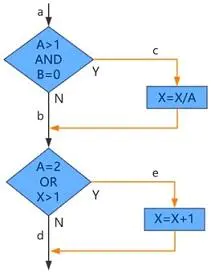
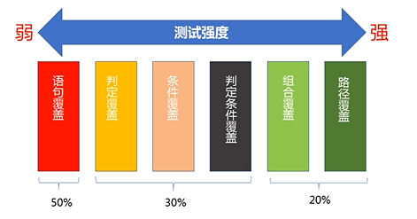

# 单元测试的任务

单元测试只针对功能点进行测试，不包括对业务流程正确性的测试

1. 接口功能性测试：保证接口能够被正常使用，并输出有效数据

   - 是否被顺利调用

   - 参数是否符合预期

2. 局部数据结构测试：保证数据结构的正确性

   - 变量是否有初始值或在某场景下是否有默认值

   - 变量是否溢出

3. 边界条件测试：测试

   - 变量无赋值(null)
   - 变量是数值或字符
   - 主要边界：最大值，最小值，无穷大
   - 溢出边界：在边界外面取值+/-1
   - 临近边界：在边界值之内取值+/-1
   - 字符串的边界，引用 "变量字符"的边界
   - 字符串的设置，空字符串
   - 字符串的应用长度测试
   - 空白集合
   - 目标集合的类型和应用边界
   - 集合的次序
   - 变量是规律的，测试无穷大的极限，无穷小的极限

4. 代码覆盖测试：保证每一句代码，所有分支都测试完成，主要包括代码覆盖率，异常处理通路测试

   - 语句覆盖率：每个语句都执行到了
   - 判定覆盖率：每个分支都执行到了
   - 条件覆盖率：每个条件都返回布尔
   - 路径覆盖率：每个路径都覆盖到了
   
5. 异常模块测试：保证每一个异常都经过测试，后续处理模块测试：是否包闭当前异常或者对异常形成消化,是否影响结果!

# 单元测试的数据准备

正常数据-数据量最大，最关键，正案例反案例都属于正常数据

边界数据-介于正常数据和异常数据之间的一种数据

异常数据-设计输入参数是测试案例进入异常分支，校验程序处理异常的能力

# 代码覆盖测试用例设计方法

## 代码覆盖定义 

以下段测试代码为例：

```java
public void foo (int a, int b, int x) {
    if(a>1 && b ==0) {
        x = x/a;
    }

    if (a==2 || x>1) {
        x = x+1;
    }
}
```




|          | 语句覆盖                         | 判定覆盖                                               | 条件覆盖                                   | 判定/条件覆盖                                                | 组合覆盖                                                     | 路径覆盖                                                     |
| -------- | -------------------------------- | ------------------------------------------------------ | ------------------------------------------ | ------------------------------------------------------------ | ------------------------------------------------------------ | ------------------------------------------------------------ |
| 覆盖范围 | 每条**语句**至少被执行一次       | 每个**判定**真假至少出现一次                           | 每个**条件**真假至少出现一次               | 每个**条件**真假至少出现一次，且每个**判定**本身真假也至少出现一次 | 每个**条件的所有可能组合**至少出现一次                       | 所有可能的**路径**至少出现一次（可画出流程图方便设计）       |
| 缺点     | 最弱的覆盖，难以发现程序中的错误 | 当判定由多个条件组合构成时，它未必能发现每个条件的错误 | 条件覆盖并不一定总能覆盖全部分支           | 条件覆盖和判定/条件覆盖不一定会发现逻辑表达式中的错误        | 组合覆盖不一定能覆盖到每条路径                               | 路径覆盖不一定把所有的条件组合情况都覆盖，复杂程序的用例数呈指数级上升，路径覆盖无法发现程序不符合设计规范的错误 |
| 例子     | a=2 b=0 x=1*`ace`*               | a=2 b=0 x=1*`ace`*<br />a=1 b=0 x=1*`abd`*             | a=1 b=0 x=3*`abe`*<br />a=2 b=1 x=1*`abe`* | a=2，b=0，x=4*`ace`* <br/>a=1，b=1，x=1*`abd`*               | a=2，b=0，x=4 *`ace`*<br/>a=2，b=1，x=1*`abe`*<br/>a=1，b=0，x=2 *`abe`*<br/>a=1，b=1，x=1*`abd`* | a=1，b=0，x=1 *`abd`*<br/>a=1，b=0，x=2 *`abe`*<br/>a=3，b=0，x=1 *`acd`*<br/>a=2，b=0，x=3 *`ace`* |

## 根据场景选择测试方式：



逻辑简单、分支较少、代码架子比较小的代码使用语句覆盖（50%）

业务价值比较高、逻辑代码比较复杂的使用判定覆盖条件覆盖甚至判定条件覆盖（30%）

最核心底层算法、框架类的代码使用组合覆盖、路径覆盖（20%）
