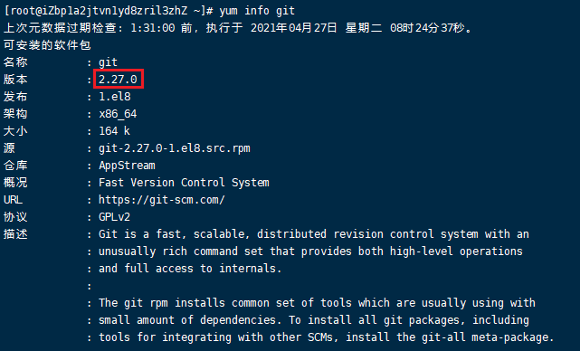

# Windows安装

下载最新版Git安装包：https://git-scm.com/download/win

打开安装包后，**可一直使用默认选项，点下一步**，下面是各步骤选项详述

1. 设置安装路径


2. 选择安装组件


3. 选择默认编辑器

   

4. 修改系统的环境变量


4. SSL的证书的选择


> **https：（全称：Hyper Text Transfer Protocol over Secure Socket Layer）**
>
> 简单讲是HTTP的安全版。即HTTP下加入SSL层，HTTPS的安全基础是SSL，因此加密的详细内容就需要SSL。 它是一个URI scheme（抽象标识符体系），句法类同[http](https://link.jianshu.com?t=https%3A%2F%2Fbaike.baidu.com%2Fitem%2Fhttp):体系。用于安全的HTTP数据传输。
>
> [参考链接：百科](https://link.jianshu.com?t=https%3A%2F%2Fbaike.baidu.com%2Fitem%2Fhttps%2F285356%3Ffr%3Daladdin)

5. 配置行尾结束符


**配置行尾结束符**

| 系统    | 换行符 |
| ------- | ------ |
| windows | \n\r   |
| unix    | \n     |
| mac     | \r     |

6. 配置终端仿真


> 大多数其他Cygwin/MSYS终端一样，MinTTY也是基于pseudo终端("pty")设备的。但是MinTTY并不能完全替代windows的[命令提示符](https://link.jianshu.com?t=https%3A%2F%2Fbaike.baidu.com%2Fitem%2F%E5%91%BD%E4%BB%A4%E6%8F%90%E7%A4%BA%E7%AC%A6)。windows上自带简单的[文本输出](https://link.jianshu.com?t=https%3A%2F%2Fbaike.baidu.com%2Fitem%2F%E6%96%87%E6%9C%AC%E8%BE%93%E5%87%BA)的原生态的[命令提示符](https://link.jianshu.com?t=https%3A%2F%2Fbaike.baidu.com%2Fitem%2F%E5%91%BD%E4%BB%A4%E6%8F%90%E7%A4%BA%E7%AC%A6)通常可以很好的工作，但交互性更好的诸如MinTTY这样的应用程序却可能出现故障——虽然通常都有应对方案。这就是为什么MinTTY不能完全替代windows自带的[命令提示符](https://link.jianshu.com?t=https%3A%2F%2Fbaike.baidu.com%2Fitem%2F%E5%91%BD%E4%BB%A4%E6%8F%90%E7%A4%BA%E7%AC%A6)。
>
> [参考链接：百科](https://link.jianshu.com?t=https%3A%2F%2Fbaike.baidu.com%2Fitem%2FMinTTY%2F9579126%3Ffr%3Daladdin)

7. 其他的配置


> 认证管理器：[参考链接](https://link.jianshu.com?t=https%3A%2F%2Fgithub.com%2FMicrosoft%2FGit-Credential-Manager-for-Windows)就是Github的账号等认证机制
>
> 符号链接：[参考](https://link.jianshu.com?t=https%3A%2F%2Fgithub.com%2Fgit-for-windows%2Fgit%2Fwiki%2FSymbolic-Links)官方介绍[参考博文](https://link.jianshu.com?t=http%3A%2F%2Fblog.csdn.net%2Fu013777351%2Farticle%2Fdetails%2F50557260)

# CentOS安装

## 仓库安装

使用yum源仓库安装，安装方便，但缺点在于安装的版本不是最新版本且无法安装历史版本，可使用下面语句查看源仓库的版本

```
yum info git
```



使用下述语句安装

```
yum -y install git
```

安装的git在`/usr/bin/git`下

## 源码安装

### 源码安装依赖的依赖库安装

```shell
yum remove git -y
yum install curl-devel expat-devel gettext-devel openssl-devel zlib-devel gcc perl-ExtUtils-MakeMaker -y
```

### 下载并解压源码

https://mirrors.edge.kernel.org/pub/software/scm/git/找到最新版本的链接

```shell
cd /usr/local/src/
wget https://mirrors.edge.kernel.org/pub/software/scm/git/git-2.9.5.tar.gz
tar zxvf git-2.9.5.tar.gz
```

### 配置安装路径，开始编译安装

安装路径为`/user/local/git`

```shell
cd git-2.9.5
./configure --prefix=/usr/local/git/
make
make install
```

### 添加到环境变量

```shell
vim /etc/profile
   i
   文件末尾添加内容:export PATH="/usr/local/git/bin:$PATH"
   :wq
source /etc/profile
```

### 查看是否安装成功（查看版本号）

```shell
git --version  
```

### 将Git设置为默认路径，不然后面克隆时会报错

```shell
ln -sf /usr/local/git/bin/git-upload-pack /bin/git-upload-pack
ln -sf /usr/local/git/bin/git-receive-pack /bin/git-receive-pack
```

