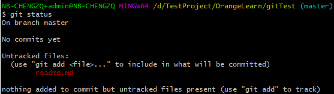
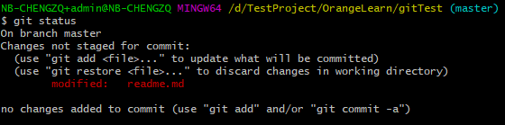

# Git简述

Git是目前世界上最先进的分布式版本控制系统

Git是免费、开源的

最初Git是为辅助 Linux 内核开发的，来替代 BitKeeper

**优点：**

- 适合分布式开发，强调个体。
- 公共服务器压力和数据量都不会太大。
- 速度快、灵活。
- 任意两个开发者之间可以很容易的解决冲突。
- 离线工作。

**缺点：**

- 模式上比SVN更加复杂。
- 不符合常规思维。
- 代码保密性差，一旦开发者把整个库克隆下来就可以完全公开所有代码和版本信息。

# 简单使用

1. 新建文件夹，在文件夹内，执行`git init`初始化仓库

   

   执行后会创建隐藏文件`.git`

   

2. 新建文件`readme.md`，内容随便输，执行`git status`查看状态为`untracked`(这个概念在Git基础中详述)

   

3. 执行`git add readme.md`提交到暂存区(这个概念在Git基础中详述)，执行`git status`查看状态为`staged`

   

4. 执行`git commit -m "创建readme"`提交到资源库(这个概念在Git基础中详述)

   

5. 修改`readme.md`文件，随便改点，执行`git status`查看状态

   

6. 执行`git checkout readme.md`，撤销`readme.md`的修改

   