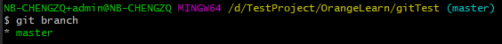
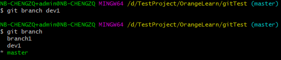
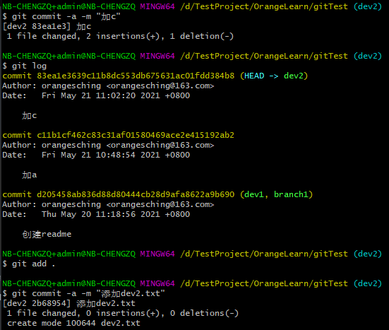

Git分支基础见三、Git基础

# 查看分支

```
# 列出所有本地分支
$ git branch

# 列出所有远程分支
$ git branch -r

# 列出所有本地分支和远程分支
$ git branch -a

# 标*为当前版本
```



# 新建分支

分支基础知识见三、Git基础。Git中新建分支即新建一个指向当前分支的指针

```
# 新建一个分支，但依然停留在当前分支
$ git branch [branch-name]

# 新建一个分支，并切换到该分支
$ git checkout -b [branch]

# 新建一个分支，指向指定commit
$ git branch [branch] [commit-id]

# 新建一个分支，与指定的远程分支建立追踪关系
$ git branch --track [branch] [remote-branch]

```

例如：新建分支后查看分支



# 切换分支

```

# 切换到指定分支，并更新工作区
$ git checkout [branch-name]

# 切换到上一个分支
$ git checkout -

# 建立追踪关系，在现有分支与指定的远程分支之间
$ git branch --set-upstream [branch] [remote-branch]

```

例1：切换到`dev1`分支，再切回上一个分支


例2：在master分支上提交两次，再新建一个分支，指向指定commit

在master提交三次


创建一个分支指向加a的commit（commit id 为c11b1）并切换到这个分支，查看提交记录没有加b的记录了


# 合并分支

## 合并分支

```
# 合并指定分支到当前分支
$ git merge [branch]

# 选择一个commit，合并进当前分支
$ git cherry-pick [commit]
```

例如：刚刚我们在master上将文件readme.md修改为a提交了一次，修改为ab提交了一次，并创建了分支dev2指向提交a时的commit，所以dev2的修改是基于内容为a的readme.md，现在在dev2上修改文件readme.md为ac，创建文件dev2.txt并提交。git log 可查看当前分支的提交记录



切换到master分支，合并master与dev2分支，这时readme.md产生冲突，可使用git status查看当前文件状态


这时分支已合并，但部分文件有冲突，需你解决冲突

## 解决冲突

解决冲突即人工将冲突部分合并后，在当前分支正常提交

如上述例子：

打开readme.md文件，发现冲突部分已在文件内，用`<<<<<<<`，`=======`，`>>>>>>>`标记出不同分支的内容

`<<<<<<< HEAD`是指主分支修改的内容

`>>>>>>> dev2` 是指dev2上修改的内容

人工修改整合两个分支的内容，再正常提交

通过`git status`可看到已经没有冲突了


# 删除分支

```
# 删除分支
git branch -d [branch-name]
# -D强制删除

# 删除远程分支
git push origin --delete [branch-name]
git branch -dr [remote/branch]
# -d表示删除分支。分支必须完全合并在其上游分支，或者在HEAD上没有设置上游
# -r表示远程的意思remotes，如果-dr则表示删除远程分支
```
