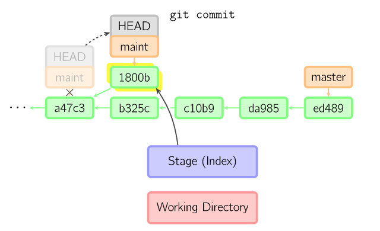
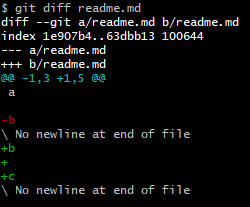
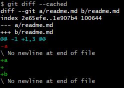

# GIT仓库创建

## 创建全新仓库

```bash
# 方式一：在当前目录新建一个Git代码库
git init
# 方式二：新建一个目录，将其初始化为Git代码库
git init [project-name]
```

执行后会再当前目录产生`.git`文件夹（隐藏的），关于版本等的所有信息都在这个目录里面，文件夹内容如下：


## 克隆远程仓库

```bash
# 克隆一个项目和它的整个代码历史(版本信息)
$ git clone [url]
```

# GIT文件操作

在Git基础中介绍到，git 模型可以抽象为  

- 本地三级仓库
  1. level1——working directory：工作区/工作目录，就是你平时存放项目代码的地方，需要git来管理的目录
  2. level2——stage(index)：暂存区，用于临时存放你的改动，它只是一个文件，保存即将提交到文件列表信息
  3. level3——repository(History) ：资源库，就是安全存放数据的位置，这里面有你提交到所有版本的数据。其中HEAD指向最新放入仓库的版本
- 远程仓库
  - Remote Directory：托管代码的服务器，可以简单的认为是你项目组中的一台电脑用于远程数据交换

git 的各个命令可以理解为在各个仓库间转移数据，各个命令对应对每个仓库输入输出


## 本地仓库操作


### 向上提交操作

#### 工作区->暂存区(`add`)

将untracked状态的文件添加到暂存区

```
# 添加指定文件到暂存区
$ git add [file1] [file2] ...

# 添加指定目录到暂存区，包括子目录
$ git add [dir]

# 添加当前目录的所有文件到暂存区
$ git add .
```

#### 暂存区->资源库(`commit`)

**`git commit`直接提交**

```
# 提交暂存区到仓库区
git commit -m [message]

# 提交暂存区的指定文件到仓库区
git commit [file1] [file2] ... -m [message]

# 提交时显示所有diff信息
git commit -v
```

原理：

| 当前分支(head)是master分支的提交                             | 当前分支(head)是非master分支的提交                           |
| ------------------------------------------------------------ | ------------------------------------------------------------ |
|                   |  |
| 提交前，master指向ed489<br />提交后，master指向新的节点f0cec并以ed489作为父节点 | maint分支就不再是*master*分支的祖父节点                      |

**`git commit --amend`覆盖提交**

```
# 使用一次新的commit，替代上一次提交
git commit --amend -m [message]

# 重做上一次commit，并包括指定文件的新变化
git commit --amend [file1] [file2] ...
```

原理：git会使用与当前提交相同的父节点进行一次新提交，旧的提交会被取消


#### 工作区->资源库(`commit -a`)

```
# 提交工作区自上次commit之后的变化，直接到仓库区，跳过了add,对新文件无效
git commit -a
```

### 向下撤销操作

#### 资源库->暂存区/工作区(`reset`)

```
git reset [版本号，默认为HEAD] <--hard/--soft/默认>
```

reset 的本质为移动HEAD到目标reset节点，并捎带上HEAD指向的分支<u>内容差异</u>，以下示意图为内容差异，即4分支上所做的修改


以下不同模式为对内容差异的处理

**--hard模式**

将**working Tree工作区**、 **index 暂存区**及 **repository资源库** 都重置成目标**Reset**节点的內容**

内容差异直接丢弃

效果等同于清空暂存区和工作区的修改，会丢失工作区修改的东西，很危险

**--soft模式**

保留**working Tree工作区**、 **index 暂存区**内容，只让**repository资源库**中的内容和**Reset**节点保持一致

内容差异体现在**index 暂存区**与**repository资源库**

即使用`git diff --cached`可查看内容差异(如示意图的4分支的修改内容)

**--mixed模式（默认）**

保留**working Tree工作区**内容，让**repository资源库**、 **index 暂存区**中的内容和**Reset**节点保持一致

内容差异体现在**working Tree工作区**与**index 暂存区**

即使用`git diff`可查看内容差异(如示意图的4分支的修改内容)

#### 资源库/暂存区->工作区(`checkout`)

```bash
# 用法一：将资源库/暂存区的指定文件/全部文件更新到工作区，不会切换HEAD分支
git checkout [-q] [<commit_id>] [--] <paths>...
# commit_id通过git log可查看每次提交的md5码
# 例如：
# 用暂存区的filename文件覆盖工作区的该文件
git checkout -- filename
# 用暂存区的所有文件直接覆盖工作区
git checkout .
# 用资源库的filename文件覆盖工作区的该文件
git checkout 53d8 -- filename

# 用法二 检出branch分支;要完成图中的三个步骤，更新HEAD以指向branch分支，以及用branch指向的树更新暂存区和工作区
# 与用法一的区别：会切换分支
git checkout [<branch><commit_id>]
# 例如：以下两句都为chekout HEAD指向的分支
git checkout
git checkout HEAD
# 以下会将HEAD指向53d8分支
git checkout 53d8

# 用法三
git checkout [-m] [[-b]--orphan] <new_branch>] [<start_point>]
```


#### reset与checkout的区别

首先不同于 reset --hard，checkout 对工作目录是安全的，它会通过检查来确保不会将已更改的文件弄丢；而 reset --hard 则会不做检查就全面地替换所有东西

第二个重要的区别是如何更新 HEAD。 reset 会移动 HEAD 分支的指向（即 HEAD 指向的分支的指向），而 checkout 只会移动 HEAD 自身来指向另一个分支


### 忽略文件

有些时候我们不想把某些文件纳入版本控制中，比如数据库文件，临时文件，设计文件等

在主目录下建立`.gitignore`文件，此文件有如下规则：

1. 忽略文件中的空行或以井号（#）开始的行
2. 可使用Linux通配符。例如：`*`代表任意多个字符，`？`代表一个字符，方括号`[abc]`代表可选字符范围，大括号`{string1,string2,...}`代表可选的字符串等
3. `!`加名称，表示例外规则，将不被忽略
4. `/`加名称，表示要忽略的文件在此目录下，而子目录中的文件不忽略。
5. 名称加`/`，表示要忽略的是此目录下该名称的子目录，而非文件（默认文件或目录都忽略）

例如：

```
#为注释
*.txt #忽略所有 .txt结尾的文件
!lib.txt #但lib.txt除外
/temp #仅忽略项目根目录下的TODO文件,不包括其它目录temp
build/ #忽略build/目录下的所有文件
doc/*.txt #会忽略 doc/notes.txt 但不包括 doc/server/arch.txt
```


## 远程仓库操作

### 远程主机管理(remote)

```
# 显示所有远程仓库
git remote -v

# 显示某个远程仓库的信息
git remote show [remote]

# 增加一个新的远程仓库，并命名
git remote add [shortname] [url]

# 删除远程主机
git remote rm <主机名>

# 重命名远程主机
git remote rename <原主机名> <新主机名>
```

### 获取更新(fetch/pull)

```
# 下载远程仓库的所有变动
$ git fetch [remote]

#获取远程仓库数据，不自动合并当前分支
git fetch [remote]

# 取回远程仓库的变化，并与本地分支合并
$ git pull [remote] [branch]

# 获取仓库所有更新，并自动合并到当前分支
git pull
```

### 上传更新

```
#上传数据，如git push origin master
git push [remote-name] [branch]

# 上传本地指定分支到远程仓库
$ git push [remote] [branch]

# 强行推送当前分支到远程仓库，即使有冲突
$ git push [remote] --force

# 推送所有分支到远程仓库
$ git push [remote] --all
```

## 查看信息

### 查看文件状态

在Git基础中介绍到，文件有四种状态：`Untracked`、`Unmodified`、`Modified`、`Staged`

可使用以下语句查看文件状态：

```bash
# 查看指定文件状态
git status [filename]

# 查看所有文件状态
git status
```

### 查看文件修改后的差异

```bash
# 查看工作区与暂存区的文件差异
git diff [files]

# 比较工作区与资源库的文件差异
git diff HEAD~n

# 查看暂存区与资源库的文件差异
git diff --cached

```


输出结果解析：

`---`代表源文件 
`+++`代表目标文件 

1. `-`开头的行，是只出现在源文件中的行
2. `+`开头的行，是只出现在目标文件中的行
3. 空格开头的行，是源文件和目标文件中都出现的行
4. 差异按照差异小结进行组织，每个差异小结的第一行都是定位语句，由`@@`开头，`@@`结尾。

例如：

对文件做以下操作：

1. 创建readme.me，加上第一行a，使用`commit -a`提交到资源库

2. 修改readme.me，加上第二行b，使用`add`提交到暂存区

3. 修改readme.me，加上第三行c，不提交

4. 使用以上三种方式查看三个位置的文件区别

   | 工作区与暂存区的文件差异                                     | 工作区与资源库的文件差异                                     | 暂存区与资源库的文件差异                                     |
   | ------------------------------------------------------------ | ------------------------------------------------------------ | ------------------------------------------------------------ |
   |  |  |  |
   | `git diff [files]`                                           | `git diff HEAD~n`                                            | `git diff --cached`                                          |

   

### 查看日志

```bash
# 查看提交日志 
git log [<options>] [<revision range>] [[\--] <path>…]
# --graph 以图形化的方式显示提交历史的关系
# -1 显示1行

# 查看所有分支日志，显示这个仓库中所有的分支的所有更新记录，包括已经撤销的更新
git reflog

```

### 查看文件列表

```bash
#查看指定状态的文件
git ls-files [-z] [-t] [-v] (--[cached|deleted|others|ignored|stage|unmerged|killed|modified])* (-[c|d|o|i|s|u|k|m])*
```

