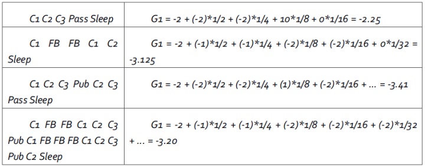
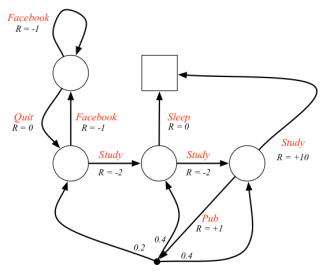
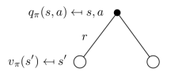
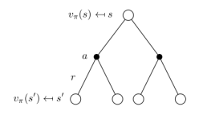
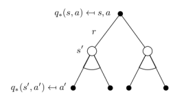

在强化学习中，马尔科夫决策过程（Markov decision process, MDP）是对环境进行描述的工具。几乎所有的强化学习问题都可以转化为MDP。 

本章的脉络为

1. 马尔科夫性（介绍状态的马尔科夫性和状态转移概率）
2. 马尔科夫过程（由有限具有马尔科夫性的状态和状态转移概率组成的马尔科夫链）
3. 马尔科夫奖励过程（在马尔科夫过程的基础上加入奖励和衰减系数）
4. 马尔科夫决策过程（在马尔科夫奖励过程的基础上加入动作）

# 马尔可夫性（Markov Property）

未来只依赖于最近给定的状态，则认为该状态具有**马尔科夫性**。即：

$$
\mathrm{P}\left[S_{\mathrm{r}+1} | \mathrm{S}_{t} \right] = \mathrm{P}\left[S_{\mathrm{}+1} | \mathrm{S}_{1}, \ldots, \mathrm{S}_{\mathrm{t}}\right]
$$

**状态转移概率公式**可以用来描述马尔科夫性：
$$
\mathcal{P}_{s s^{\prime}}=\mathrm{P}\left[S_{t+1}=s^{\prime} | S_{t}=s\right]
$$
**状态转移矩阵** $\mathcal{P}$ 用来表示当前任意状态转移到其他状态的概率。每一行代表，当前处于这种状态时，下一个状态出现的概率
$$
\text{to} \\
\mathcal{P}=\text { from }\left[\begin{array}{ccc}{\mathcal{P}_{11}} & {\cdots} & {\mathcal{P}_{1 n}} \\ {\vdots} & {} & {} \\ {\mathcal{P}_{n 1}} & {\cdots} & {\mathcal{P}_{n n}}\end{array}\right]
$$

 式中n为状态数量，矩阵中每一行元素之和为1. 

# 马尔可夫过程（Markov Process）

 **马尔科夫过程** 又叫马尔科夫链(Markov Chain)，是一个无记忆的随机过程

## 描述

可以用一个元组$<S, \mathcal{P}>$表示

- $S$ 是具有马尔科夫性的有限随机状态集$\{\mathrm{S}_1，\mathrm{S}_2，\cdots\}$
- $\mathcal{P}$是状态之间的转移概率矩阵

## 例

圆圈表示学生所处的状态，方块Sleep表示马尔科夫链的最终状态或者可以描述成自循环的状态，也就是Sleep状态的下一个状态100%的几率还是自己。箭头表示状态之间的转移，箭头上的数字表示当前转移的概率。 右边是这个马尔科夫链对应的状态转移矩阵。

 当学生处在第一节课（Class1）时，他/她有50%的几率会参加第2节课（Class2）；同时在也有50%的几率不在认真听课，进入到浏览facebook这个状态中。在浏览facebook这个状态时，他有90%的几率在下一时刻继续浏览，也有10%的几率返回到课堂内容上来。当学生进入到第二节课（Class2）时，会有80%的几率继续参加第三节课（Class3），也有20%的几率觉得课程较难而退出（Sleep）。当学生处于第三节课这个状态时，他有60%的几率通过考试，继而100%的退出该课程，也有40%的可能性去酒吧，又分别有20%、40%、40%的几率返回值第一、二、三节课重新继续学习。 

一个学生从状态Class1开始，最终结束于Sleep，其间的过程根据状态转化图可以有很多种可能性，这些都称为**样本集（Sample Episodes）**。一个**采样**是从初始状态到结束状态的一个状态序列，以下采样都是可能的：

- C1 - C2 - C3 - Pass - Sleep
- C1 - FB - FB - C1 - C2 - Sleep
- C1 - C2 - C3 - Pub - C2 - C3 - Pass - Sleep

# 马尔科夫奖励过程（ Markov Reward Process）

马尔科夫奖励过程可以看做带有value判断的马尔科夫过程，这个value标志着这个状态的好坏。它在马尔科夫过程的基础上增加了**奖励$R$**和**衰减系数$\gamma$**。

## 描述 / 概念

可以用四元组$<S, P, R, \gamma>$表示，分别是状态，转移概率，即时奖励，衰减系数。

- **即时奖励（Reward）** $R$

  某一时刻（$t$）处在状态$s$下，在下 一个时刻（$t+1$）能获得的**奖励期望**，即为状态$s$下的奖励，与下一刻去哪个状态没有关系：
  $$
  R_{s}=E\left[R_{t+1} | S_{t}=s\right]
  $$
  例：马尔科夫奖励过程图示。在“马尔科夫过程”基础上增加了针对每一个状态的奖励

  

  当学生处于 Class1 状态时，若他选择参加 Class2 获得的 Reward 是 -2；若他选择去刷 Facebook  获得的 Reward 是 -2。即他从 Class1 状态离开就可获得立即奖励，这个即时奖励和他去哪没关系。

  

- **收益（ Return）** $G_t$

  由于即时奖励与具体的下一状体没关系，引入收益，来量化一个片段（Episode）的奖励和

  收益为在一个马尔科夫奖励链上从 $t$ 时刻开始往后所有有衰减的奖励和。公式如下：

  $$
  G_{t}=R_{t+1}+\gamma R_{t+2}+\ldots=\sum_{k=0}^{\infty} \gamma^{k} R_{t+k+1}
  $$
  其中**衰减系数 （Discount Factor）** $\gamma \in [0,1]$ 体现了未来的奖励在当前时刻的价值比例，在 $k+1$ 时刻获得的奖励 $R$ 在t时刻的体现出的价值是  $\gamma^{k} R$，$\gamma$ 接近于0，表明趋向于“近视”性评估（贪婪）；γ接近1则表明偏重考虑远期的收益。

  *这里是从$R_{t+1}$开始算起的，因为描述上通常是智能体在$t$时刻做了一个操作，环境接收操作后更新时间，所以这个奖励通常描述为$R_{t+1}$*

  > 衰减系数的引入有很多理由，其中有数学表达的方便，避免陷入无限循环，远期利益具有一定的不确定性，符合人类对于眼前利益的追求，符合金融学上获得的利益能够产生新的利益因而更有价值等等。

  

  

  收益值是针对一次片段的结果，存在很大的样本偏差。$G_t$ 是从 $t$ 时刻的状态到终止状态的一条状态转移序列的收益值，但从 $t$ 时刻的状态到终止状态可能有多条路径，就如上述状态转移图所示（而且可能还有很多序列没有观测到）。故要想精确的计算出 $G_t$ 是不可能的，因为无法穷举所有序列。

  

- **价值函数 Value Function**

  引入价值函数是为了解决每个取样都对应一个$G_t$的问题。价值函数是一个数值包含了多条路径。

  价值函数给出了某一状态或某一行为的长期价值，用来衡量一个状态的好坏。

  一个马尔科夫奖励过程中某一状态的价值函数，为从该状态开始的马尔可夫链收获的期望：

  $$
  v(s)=E\left[G_{t} | S_{t}=s\right]
  $$
  *注：价值可以仅描述状态，也可以描述某一状态下的某个行为，在一些特殊情况下还可以仅描述某个行为*

  

## 例

为方便计算，把“学生马尔科夫奖励过程”示例图表示成下表的形式。表中第二行对应各状态的即时奖励值，蓝色区域数字为状态转移概率，表示为从所在行状态转移到所在列状态的概率：

**收益计算例**

在$t=1$时刻（$S_{1}=C_{1}$）时状态 $S_1$ 的收益公式：			
$$
G_{1}=R_{2}+\gamma R_{3}+\ldots +\gamma^{r-2} R_{r}
$$
如下4个马尔科夫链取样，现计算当$\gamma= 1/2$时的收益值。

从上表也可以理解到，收益是针对一个马尔科夫链中的**某一个状态**来说的。且收益是不确定的，随机的（因为取样是随机的）。但是价值函数不是随机的，价值函数是收益的期望

**价值计算例**

对于上述状态转移图如果仅仅观测到以上 4 条序列，那么在状态 Class1 处的学生的值函数就是上述 4 个 值除以 4 即可。
$$
v(Class1) = ( (-2.25) + (-3.125) + (-3.41) + (-3.21) )  ÷ 4 =  2.996
$$

**不同衰减系数下**

当$\gamma = 0$时，上表描述的MRP中，各状态的即时奖励就与该状态的价值相同。当$\gamma \neq 0$时，各状态的价值需要通过计算得到，这里先给出$ \gamma $分别为0，0.9，和1三种情况下各状态的价值，如下图所示。

各状态圈内的数字表示该状态的价值，圈外的$R=-2$等表示的是该状态的即时奖励。

> **各状态价值的确定是很重要的，RL的许多问题可以归结为求状态的价值问题**。假设你已经算出来上面的各个状态下的值函数，那么对于强化学习而言，假设是找到一条最优路径，起点状态是 Class1 ，那么很明显最优状态链是class1->class2->class3->pass->sleep，也就是说**这条路径的累计回报**最大，也就是说值函数求出来了，其实强化学习问题就解决了，对应的就是后续的值迭代法、Q-learning等思路了。因此如何求解各状态的价值，也就是寻找一个价值函数（从状态到价值的映射）就变得很重要了。

## 价值函数的推导

状态值函数的引入解决了不同路径收益不同问题。但状态值函数不好算，因为在计算某个状态的价值时，需要使用到将来所有状态的 $G_t$，这明显是不科学的。所以需要进一步推导价值函数**使价值函数容易求解**。

### 按价值定义公式推导

$$
\begin{aligned} v(s) &=\mathbb{E}\left[G_{t} | S_{t}=s\right] \\ &=\mathbb{E}\left[R_{t+1}+\gamma R_{t+2}+\gamma^{2} R_{t+3}+\ldots | S_{t}=s\right] \\ &=\mathbb{E}\left[R_{t+1}+\gamma\left(R_{t+2}+\gamma R_{t+3}+\ldots\right) | S_{t}=s\right] \\ &=\mathbb{E}\left[R_{t+1}+\gamma G_{t+1} | S_{t}=s\right] \\ &=\mathbb{E}\left[R_{t+1}+\gamma v\left(S_{t+1}\right) | S_{t}=s\right] \end{aligned}
$$

在导出最后一行时，将$G_{t+1}$ 变成了 $v\left(S_{t+1}\right)$。其理由是收获的期望等于收获的期望的期望。

### Bellman方程

先看看贝尔曼方程是什么

> 贝尔曼方程，又叫动态规划方程，是以Richard Bellman命名的，表示动态规划问题中相邻状态关系的方程。某些决策问题可以按照时间或空间分成多个阶段，每个阶段做出决策从而使整个过程取得效果最优的多阶段决策问题，可以用动态规划方法求解。某一阶段最优决策的问题，通过贝尔曼方程转化为下一阶段最优决策的子问题，从而初始状态的最优决策可以由终状态的最优决策(一般易解)问题逐步迭代求解。存在某种形式的贝尔曼方程，是动态规划方法能得到最优解的必要条件。 

（哦！动态规划的递推式，推出了这个就可以用递归/递推来求价值函数了）

根据上面对价值函数的定义公式的推导，最后我们得到了针对MRP的Bellman方程： 
$$
v(s)=\mathbb{E}\left[R_{t+1}+\gamma v\left(S_{t+1}\right) | S_{t}=s\right]
$$

通过方程可以看出 $v(s)$ 由两部分组成

- $s$ 状态的即时奖励期望。即时奖励期望等于即时奖励，因为根据即时奖励的定义，它与下一个状态无关

- 下一时刻状态的价值期望的衰减值，可以根据下一时刻状态的概率分布得到其期望。

  

如果用 $s’$ 表示 $s$ 状态下一时刻任一可能的状态，那么Bellman方程可以写成：
$$
v(s)=\mathcal{R}_{s}+\gamma \sum_{s^{\prime} \in \mathcal{S}} \mathcal{P}_{s s^{\prime}} v\left(s^{\prime}\right)
$$
即计算状态 s 的值函数方法 = 该状态的立即奖励 + 遍历该状态的各个后继状态，对于每一个后继状态：$\gamma$  × 状态转移概率  × 后继状态的值函数 求和。 

**例**
下图已经给出了$\gamma=1$时各状态的价值，状态$C_3$  的价值可以通过状态Pub和Pass的价值以及他们之间的状态转移概率来计算：
$$
4.3=-2+1.0 *(0.6 * 10+0.4 * 0.8)
$$

### Bellman方程的矩阵形式和求解

$$
v=\mathcal{R}+\gamma \mathcal{P} v
$$

结合矩阵的具体表达形式还是比较好理解的：
$$
\left[\begin{array}{c}{v(1)} \\ {\vdots} \\ {v(n)}\end{array}\right]=\left[\begin{array}{c}{\mathcal{R}_{1}} \\ {\vdots} \\ {\mathcal{R}_{n}}\end{array}\right]+\gamma\left[\begin{array}{ccc}{\mathcal{P}_{11}} & {\cdots} & {\mathcal{P}_{1 n}} \\ {\vdots} & {} & {} \\ {\mathcal{P}_{11}} & {\cdots} & {\mathcal{P}_{n n}}\end{array}\right]\left[\begin{array}{c}{v(1)} \\ {\vdots} \\ {v(n)}\end{array}\right]
$$
Bellman方程是一个线性方程组，因此理论上解可以直接求解：
$$
\begin{aligned} v & = \mathcal { R } + \gamma \mathcal { P } v \\ ( I - \gamma \mathcal { P } ) v & = \mathcal { R } \\ v & = ( l - \gamma \mathcal { P } ) ^ { - 1 } \mathcal { R } \end{aligned}
$$
实际上，计算复杂度是$O(n^3)$ ， $n$是状态数量。因此直接求解仅适用于小规模的MRPs。大规模MRP的求解通常使用迭代法。常用的迭代方法有：动态规划Dynamic Programming、蒙特卡洛评估Monte-Carlo evaluation、时序差分学习Temporal-Difference。

# 马尔科夫决策过程（Markov Decision Process）

相较于马尔科夫奖励过程，马尔科夫决策过程多了一个行为集合$A$

## 区别

马尔科夫决策过程(MDP)与MP、MRP的区别

- 在MP和MRP中，我们都是作为观察者，去观察其中的状态转移现象，去计算回报值
- 对于一个RL问题，我们更希望去改变状态转移的流程，去最大化回报值
- 通过MRP中引入决策即得到了马尔科夫决策过程

## 描述 / 概念

它是这样的一个五元组$M=(S,A,P,R,\gamma)$描述

- $ S $：表示状态集(states)，有$s \in S$，$s_i$ 表示第 $i$ 步的状态。

- $A$：表示一组动作(actions)，有$a \in A$，$a_i$ 表示第 $i$ 步的动作。

- $P$：表示状态转移概率。表示的是在当前$s \in S$状态下，经过$a \in A$作用后，会转移到的其他状态的概率分布情况。比如，在状态$s$下执行动作$a$，转移到$s'$的概率可以表示为$p(s'|s,a)$，具体的数学表达式如下：
  $$
  \mathcal{P}_{s s^{\prime}}^{a}=\mathbb{P}\left[S_{t+1}=s^{\prime} | S_{t}=s, A_{t}=a\right]
  $$
  （个人理解：马尔科夫奖励过程是在当前状态下选择到下一状态，而马尔可夫决策过程是在当前状态下先选择一个动作，这个动作会有不同的概率导向不同的新状态，智能体只能做这个动作，不能控制这个动作导向的状态，这个动作导向的结果由环境决定，所以马尔可夫决策过程很适合描述强化学习场景。这里的状态转移概率矩阵是三维的，第一维是当前状态，第二维是所做动作，第三维是下一状态，下面的回报函数同理）

- $R$：回报函数(reward function)。$R(s, a)$ 描述了在状态 $s$做动作 $a$的奖励。与MRP的奖励与状态对应不同，**MDP的奖励是与动作对应的**，具体的数学表达式如下：
  $$
  \mathcal{R}_{s}^{a}=\mathbb{E}\left[R_{t+1} | S_{t}=s, A_{t}=a\right]
  $$

- $\gamma$ ：衰减系数

注意：$P$和$R$看起来很类似马尔科夫奖励过程，但这里的它们都与具体的**行为** $a$ 对应，而不像马尔科夫奖励过程那样仅对应于某个状态

在马尔可夫决策过程中能够随意愿改变的变成了动作。我们关心的是在什么情况先该做什么动作

**例**

下图给出了一个可能的MDP的状态转化图。图中红色的文字表示的是采取的行为，而不是先前的状态名。对比之前的学生MRP示例可以发现，即时奖励与行为对应了，同一个状态下采取不同的行为得到的即时奖励是不一样的。由于引入了Action，容易与状态名混淆，因此此图没有给出各状态的名称；此图还把Pass和Sleep状态合并成一个终止状态；另外当选择”去酒吧”这个动作时，**主动**进入了一个临时状态（ 这样的状态不属于MDP中考虑的状态 ，图中用黑色小实点表示），随后**被动的**被环境按照其动力学分配到另外三个状态（正式的），也就是说Agent做出一个动作后没有权利选择决定去哪一个状态。

 注，图中除了在 Class4 状态上执行 去酒吧 动作外，其他的所有状态跳转都是确定性，我们通过在不同的状态上执行不同的动作，实现状态跳转。 

### 策略Policy

策略 $\pi$ 是概率的集合或分布，其元素 $\pi(a|s)$  在某一状态$s$采取可能的行为$a$的概率。用$\pi(a|s)$  表示
$$
\pi ( a | s ) = \mathbb { P } \left[ A _ { t } = a | S _ { t } = s \right]
$$
策略π有两个含义

1. 当为确定性策略的时候，$\pi$就等于$a$表示一个动作；
2. 当策略不确定的时候，就表示一个动作分布。假设动作是有限的，我们就会写成一个向量，向量上的值对应相应动作的概率，该向量求和为1

注意：

- 策略是对智能体行为的全部描述，若策略给定，所有动作将被确定。

- 在MDPs中的策略是基于马尔科夫状态的（而不是基于历史的）

- 策略是时间稳定的，只和$s$有关，与时间$t$无关。

- 策略是RL问题的终极目标

- 如果策略的概率分布输出的是独立的，那么称为确定性策略，否则为随机策略。

  

**MDP与MRP的关系**

当给定一个MDP: $M=(S,A,P,R,\gamma)$ 和一个策略$\pi$，那么状态序列$S_1,S_2,\cdots$  是一个马尔科夫过程$<S,P^{\pi}>$ ；同样，状态和奖励序列$S_1,R_2,S_2,R_3,S_3\cdots$   是一个马尔科夫奖励过程$<S,P^{\pi},R^{\pi},\gamma>$  ，并且在这个奖励函数和转移概率如下中满足下面两个方程：
$$
\mathcal { P } _ { s , s ^ { \prime } } ^ { \pi } = \sum _ { a \in \mathcal { A } } \pi ( a | s ) \mathcal { P } _ { s s ^ { \prime } } ^ { a }
$$

$$
\mathcal { R } _ { s } ^ { \pi } = \sum _ { a \in \mathcal { A } } \pi ( a | s ) \mathcal { R } _ { s } ^ { a }
$$

在执行策略 $\pi$  时，状态从 $s$ 转移至 $s'$ 的概率等于一系列概率的和。因为到状态$s'$一定要做一个动作同时又跳转到了$s'$，所以这整个事件发生的概率就是在$s$状态执行了$a$动作的概率 乘 执行这个动作$a$正好跳转到了$s'$的概率 之和。奖励函数同理

策略在MDP中的作用相当于agent可以在某一个状态时做出选择，进而有形成各种马尔科夫过程的可能，而且基于策略产生的每一个马尔科夫过程是一个马尔科夫奖励过程，各过程之间的差别是不同的选择产生了不同的后续状态以及对应的不同的奖励。

### 基于策略π的价值函数

- **状态价值函数$v_\pi(s)$**  ，表示从状态$s$开始，**遵循当前策略**时所获得的收获的期望；或者说在执行当前策略 $\pi$ 时，衡量个体处在状态 $s$ 时的价值大小。数学表示如下：

$$
v _ { \pi } ( s ) = \mathbb { E } _ { \pi } \left[ G _ { t } | S _ { t } = s \right]
$$

- **行为价值函数$q_\pi(s,a)$**，表示在执行策略 $\pi$ 时，对当前状态 $s$ 执行某一具体行为 $a$ 所能的到的收获的期望；或者说在遵循当前策略π时，衡量对当前状态执行行为a的价值大小。行为价值函数一般都是与某一特定的状态相对应的，更精细的描述是**状态行为对**价值函数。行为价值函数的公式描述如下：
$$
  q _ { \pi } ( s , a ) = \mathbb { E } _ { \pi } \left[ G _ { t } | S _ { t } = s , A _ { t } = a \right]
$$

**注:MDPs 中，任何不说明策略π 的情况下，讨论值函数都是在耍流氓！**

- **$v _ { \pi } ( s ) $和的$q _ { \pi } ( s , a ) $关系**

  

  上图中，空心较大圆圈表示状态，黑色实心小圆表示的是动作本身，连接状态和动作的线条仅仅把该状态以及该状态下可以采取的行为关联起来。可以看出，在遵循策略π时，状态s的价值体现为在该状态下遵循某一策略而采取所有可能行为的价值按行为发生概率的乘积求和。
  $$
  v _ { \pi } ( s ) = \sum _ { a \in A } \pi ( a | s ) q _ { \pi } ( s , a )
  $$

  类似的，一个行为价值函数也可以表示成状态价值函数的形式：
$$
q _ { \pi } ( s , a ) = \mathcal { R } _ { s } ^ { a } + \gamma \sum _ { s ^ { \prime } \in \mathcal { S } } \mathcal { P } _ { s s ^ { \prime } } ^ { a } v _ { \pi } \left( s ^ { \prime } \right)
$$
  它表明，一个某一个状态下采取一个行为的价值，可以分为两部分：其一是离开这个状态的价值，其二是所有进入新的状态的价值于其转移概率乘积的和。

  如果组合起来，可以得到下面的结果：
$$
v _ { \pi } ( s ) = \sum _ { a \in \mathcal { A } } \pi ( a | s ) \left( \mathcal { R } _ { s } ^ { a } + \gamma \sum _ { s ^ { \prime } \in \mathcal { S } } \mathcal { P } _ { s s ^ { \prime } } ^ { a } v _ { \pi } \left( s ^ { \prime } \right) \right)
$$

  也可以得到下面的结果：
$$
q _ { \pi } ( s , a ) = \mathcal { R } _ { s } ^ { a } + \gamma \sum _ { s ^ { \prime } \in \mathcal { S } } \mathcal { P } _ { s s ^ { \prime } } ^ { a } \sum _ { a ^ { \prime } \in \mathcal { A } } \pi \left( a ^ { \prime } | s ^ { \prime } \right) q _ { \pi } \left( s ^ { \prime } , a ^ { \prime } \right)
$$

  

  例：
  下图解释了红色空心圆圈状态的状态价值是如何计算的，遵循的策略随机策略，即所有可能的行为有相同的几率被选择执行。

## 价值函数的推导

### Bellman期望方程

和 MRP 相似，MDPs 中的值函数也能分解成瞬时奖励和后继状态的值函数两部分：
$$
v _ { \pi } ( s ) = \mathbb { E } _ { \pi } \left[ R _ { t + 1 } + \gamma v _ { \pi } \left( S _ { t + 1 } \right) | S _ { t } = s \right]
$$

$$
q _ { \pi } ( s , a ) = \mathbb { E } _ { \pi } \left[ R _ { t + 1 } + \gamma q _ { \pi } \left( S _ { t + 1 } , A _ { t + 1 } \right) | S _ { t } = s , A _ { t } = a \right]
$$

### Bellman期望方程矩阵形式

$$
v _ { \pi } = \mathcal { R } ^ { \pi } + \gamma \mathcal { P } ^ { \pi } v _ { \pi }
$$

$$
v _ { \pi } = \left( l - \gamma \mathcal { P } ^ { \pi } \right) ^ { - 1 } \mathcal { R } ^ { \pi }
$$

## 优化问题

之前值函数，以及贝尔曼期望方程针对的都是给定策略 $\pi$  的情况，是一个评价的问题（评价策略 $\pi$ 的好坏）。
现在来讨论强化学习中的优化问题，即找出最好的策略。

### 最优价值函数

最优值函数指的是在所有策略中的值函数最大值，其中包括最优 V 函 数和最优 Q 函数

- 最优状态价值函数 $v_{*}(s)$  指的是在从所有策略产生的状态价值函数中，选取使状态 $s$ 价值最大的函数：
  $$
  { v _ { * } ( s ) = \max _ { \pi } v _ { \pi } ( s ) }
  $$

- 最优行为价值函数 $q_*(s,a)$ 指的是从所有策略产生的行为价值函数中，选取是状态行为对  $<s,a>$  价值最大的函数：

  $$
  { q _ { * } ( s , a ) = \max q _ { \pi } ( s , a ) }
  $$

  最优价值函数明确了MDP的最优可能表现，当我们知道了最优价值函数，也就知道了每个状态的最优价值，这时便认为这个MDP获得了解决。

- 例：

  学生MDP问题的最优状态价值

  

  学生MDP问题的最优行为价值

  
  注：youtube留言认为Pub行为对应的价值是+9.4而不是+8.4

### 最优策略

- **定义**

  当对于任何状态 $s$，遵循策略π的价值不小于遵循策略 $\pi'$ 下的价值，则策略 $\pi$ 优于策略 $\pi’$：

  $$
  \pi \geq \pi ^ { \prime } \text { if } v _ { \pi } ( s ) \geq v _ { \pi ^ { \prime } } ( s ) , \forall s
  $$

  > **定理** 
  > 对于任何MDP，下面几点成立：
  > 1.存在一个最优策略，比任何其他策略更好或至少相等；
  > 2.所有的最优策略有相同的状态价值函数；
  > 3.所有的最优策略具有相同的行为价值函数。

- **寻找最优策略**

  可以通过最大化最优行为价值函数来找到最优策略：
  $$
  \pi _ { * } ( a | s ) = \left\{ \begin{array} { l l } { 1 } & { \text { if } a = \underset { a \in \mathcal { A } } { \operatorname { argmax } } q _ { * } ( s , a ) } \\ { 0 } & { \text { otherwise } } \end{array} \right.
  $$
  对于任何MDP问题，总存在一个确定性的最优策略；同时如果我们知道最优行为价值函数，则表明我们找到了最优策略。

- **学生MDP最优策略示例**

  红色箭头表示的行为表示最优策略

  

### Bellman最优方程

- 定义

  针对 $v_*$ ，一个状态的最优价值等于从该状态出发采取的所有行为产生的行为价值中最大的那个行为价值：
  $$
  v _ { * } ( s ) = \max _ { a } q _ { * } ( s , a )
  $$
  

  针对 $q _ { * }$ ，在某个状态$s$下，采取某个行为的最优价值由2部分组成，一部分是离开状态 s 的即刻奖励，另一部分则是所有能到达的状态 s’ 的最优状态价值按出现概率求和：
  $$
  q _ { * } ( s , a ) = \mathcal { R } _ { s } ^ { a } + \gamma \sum _ { s ^ { \prime } \in \mathcal { S } } \mathcal { P } _ { s s ^ { \prime } } ^ { a } v _ { * } \left( s ^ { \prime } \right)
  $$
  

  

  组合起来，针对 $v _ { * }$ ，有：
  $$
  v _ { * } ( s ) = \max _ { a } \mathcal { R } _ { s } ^ { a } + \gamma \sum _ { s ^ { \prime } \in \mathcal { S } } \mathcal { P } _ { s s ^ { \prime } } ^ { a } v _ { * } \left( s ^ { \prime } \right)
  $$
  

  针对 $q _ { * }$ ，有：
  $$
  q _ { * } ( s , a ) = \mathcal { R } _ { s } ^ { a } + \gamma \sum _ { s ^ { \prime } \in \mathcal { S } } \mathcal { P } _ { s s ^ { \prime } } ^ { a } \max _ { a ^ { \prime } } q _ { * } \left( s ^ { \prime } , a ^ { \prime } \right)
  $$
  

- **Bellman最优方程学生MDP示例**

  

- **求解Bellman最优方程**

  对于Bellman期望方程，可以使用矩阵求逆来求解
  
  但Bellman最优方程是非线性的，没有固定的解决方案，通过一些迭代方法来解决：价值迭代、策略迭代、Q学习、Sarsa等。后续会逐步讲解展开。