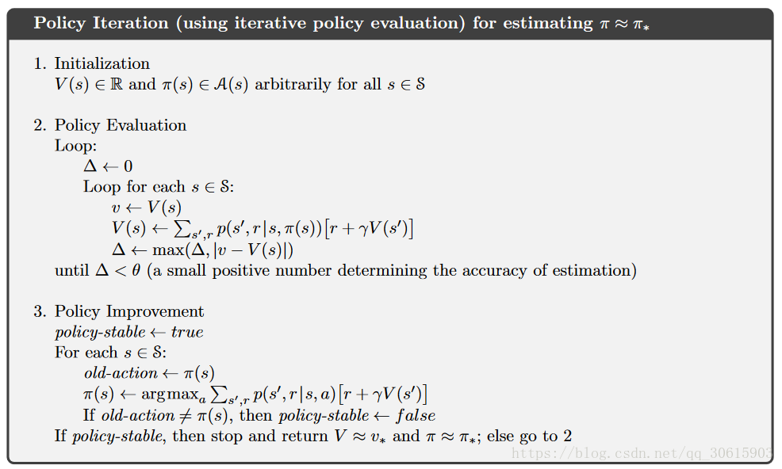

# 强化学习问题提出

强化学习是解决**序列决策问题**，即**状态->行动->新状态.....->终点** 这一系列动作的决策，做出的决策要**最大化总的奖励**，

其中有很多概念，要理解清楚：

- 历史：【观察，行为，奖励】构成的序列
- 状态：对历史信息的总结，决定奖励啊行为的信息，不等于观察值
- 行动：智能体做的动作
- 奖励：环境对智能体动作的即时反馈
- 策略：决定智能体行为的机制，状态到行为的映射
- 价值函数：未来奖励的预测，用来评价当前状态的好坏程度
- 模型：智能体对环境的建模。至少要解决 状态转移概率 和 预测可获得的即时奖励 两个问题

其中智能体可由三个部分组成：策略、价值函数、模型

# 马尔科夫全家桶

## 马尔科夫性

定义：未来只依赖于最近给定的状态，则认为这个状态有**马尔科夫性**

**转移概率公式**和**转移概率矩阵**可用来表示当前任意状态转移到其他状态的概率
$$
\mathcal{P}_{s s^{\prime}}=\mathrm{P}\left[S_{t+1}=s^{\prime} | S_{t}=s\right]
$$

## 马尔科夫过程（马尔科夫链）

由有限具有马尔科夫性的状态和状态转移概率组成的马尔科夫链

可以用一个元组$<S, \mathcal{P}>$表示

- $S$ 是具有马尔科夫性的有限随机状态集$\{\mathrm{S}_1，\mathrm{S}_2，\cdots\}$
- $\mathcal{P}$是状态之间的转移概率矩阵

## 马尔科夫奖励过程

在马尔科夫过程的基础上加入奖励和衰减系数，我们要做的是评价这个策略

可以用四元组$<S, P, R, \gamma>$表示

- $S$ 是具有马尔科夫性的有限随机状态集$\{\mathrm{S}_1，\mathrm{S}_2，\cdots\}$
- $\mathcal{P}$是状态之间的转移概率矩阵
- $R$是**即时奖励**，即离开状态s可获得的奖励，与下一刻去哪无关，$R_{s}=E\left[R_{t+1} | S_{t}=s\right]$
- $\gamma$是衰减系数，用在计算收益中

由于即时奖励$R$，与具体的下一状态没有关系，引入**收益（Return）$G_t$**，来量化一个片段（Episode）的奖励和
$$
G_{t}=R_{t+1}+\gamma R_{t+2}+\ldots=\sum_{k=0}^{\infty} \gamma^{k} R_{t+k+1}
$$
又因为收益$G_t$只是针对一个Episode，不是针对长期的过程，不能用来评估整个马尔科夫奖励过程的收益，所以引入**价值函数（Value Function）**来衡量某一状态或行为的长期价值（计算方式：只要一个Episode出现了状态s，就把这个Episode的收益加进去，最后除以加进去Episode的数量）
$$
v(s)=E\left[G_{t} | S_{t}=s\right]
$$
因为这个价值函数的公式算起来很复杂（要记录所有Episode），所以引入Bellman方程，得到**价值函数的Bellman期望方程**（计算方式：该状态的即时奖励 + 遍历该状态的各个后继状态，对于每一个后继状态：$\gamma$  × 状态转移概率  × 后继状态的值函数 求和）
$$
v(s)=\mathcal{R}_{s}+\gamma \sum_{s^{\prime} \in \mathcal{S}} \mathcal{P}_{s s^{\prime}} v\left(s^{\prime}\right)
$$
这个公式把刚刚复杂的公式分成了两个部分：状态s的即时奖励和下一时刻的价值期望，这样就可以很方便的用递归或者迭代的方式求解

再进一步，转化为矩阵形式
$$
\begin{aligned} 
v & = \mathcal { R } + \gamma \mathcal { P } v \\ ( I - \gamma \mathcal { P } ) v & = \mathcal { R } \\ v & = ( l - \gamma \mathcal { P } ) ^ { - 1 } \mathcal { R } \end{aligned}
$$

## 马尔科夫决策过程（最终用来描述强化学习问题）

在马尔科夫奖励过程的基础上加入动作

可以用一个五元组$M=(S,A,P,R,\gamma)$描述

- $ S $：表示状态集(states)，有$s \in S$，$s_i$ 表示第 $i$ 步的状态。

- $A$：表示一组动作(actions)，有$a \in A$，$a_i$ 表示第 $i$ 步的动作。

- $P$：表示状态转移概率。表示的是在当前$s \in S$状态下，经过$a \in A$作用后，会转移到的其他状态的概率分布情况。比如，在状态$s$下执行动作$a$，转移到$s'$的概率可以表示为$p(s'|s,a)$，具体的数学表达式如下：
  $$
  \mathcal{P}_{s s^{\prime}}^{a}=\mathbb{P}\left[S_{t+1}=s^{\prime} | S_{t}=s, A_{t}=a\right]
  $$
  （个人理解：马尔科夫奖励过程是在当前状态下选择到下一状态，而马尔可夫决策过程是在当前状态下先选择一个动作，这个动作会有不同的概率导向不同的新状态，智能体只能做这个动作，不能控制这个动作导向的状态，这个动作导向的结果由环境决定，所以马尔可夫决策过程很适合描述强化学习场景。这里的状态转移概率矩阵是三维的，第一维是当前状态，第二维是所做动作，第三维是下一状态，下面的回报函数同理）

- $R$：回报函数(reward function)。$R(s, a)$ 描述了在状态 $s$做动作 $a$的奖励。与MRP的奖励与状态对应不同，**MDP的奖励是与动作对应的**，具体的数学表达式如下：
  $$
  \mathcal{R}_{s}^{a}=\mathbb{E}\left[R_{t+1} | S_{t}=s, A_{t}=a\right]
  $$

- $\gamma$ ：衰减系数

上述的状态转移概率只是做了某个动作后，从临时状态到某具体状态的转移概率。在某个状态做某一个动作的概率用**策略(Policy)**来表示。策略是概率的集合或分布，其元素是在某一状态s才去可能的行为a的概率：
$$
\pi ( a | s ) = \mathbb { P } \left[ A _ { t } = a | S _ { t } = s \right]
$$
### 评估策略

#### 价值函数

MDP的即时奖励，收益$G_t$与MRP一样，但是因为引入了动作，所以价值函数不一样了，MDP的价值函数分为两种

- **状态价值函数$v_\pi(s)$**  ，表示从状态$s$开始，**遵循当前策略**时所获得的收获的期望；或者说在执行当前策略 $\pi$ 时，衡量个体处在状态 $s$ 时的价值大小。数学表示如下：

$$
v _ { \pi } ( s ) = \mathbb { E } _ { \pi } \left[ G _ { t } | S _ { t } = s \right]
$$

- **行为价值函数$q_\pi(s,a)$**，表示在执行策略 $\pi$ 时，对当前状态 $s$ 执行某一具体行为 $a$ 所能的到的收获的期望；或者说在遵循当前策略π时，衡量对当前状态执行行为a的价值大小。行为价值函数一般都是与某一特定的状态相对应的，更精细的描述是**状态-行为**价值函数。行为价值函数的公式描述如下：
  $$
  q _ { \pi } ( s , a ) = \mathbb { E } _ { \pi } \left[ G _ { t } | S _ { t } = s , A _ { t } = a \right]
  $$

- 两者的关系
$$
  v _ { \pi } ( s ) = \sum _ { a \in A } \pi ( a | s ) q _ { \pi } ( s , a )\\
  q _ { \pi } ( s , a ) = \mathcal { R } _ { s } ^ { a } + \gamma \sum _ { s ^ { \prime } \in \mathcal { S } } \mathcal { P } _ { s s ^ { \prime } } ^ { a } v _ { \pi } \left( s ^ { \prime } \right)\\
  v _ { \pi } ( s ) = \sum _ { a \in \mathcal { A } } \pi ( a | s ) \left( \mathcal { R } _ { s } ^ { a } + \gamma \sum _ { s ^ { \prime } \in \mathcal { S } } \mathcal { P } _ { s s ^ { \prime } } ^ { a } v _ { \pi } \left( s ^ { \prime } \right) \right)\\
  q _ { \pi } ( s , a ) = \mathcal { R } _ { s } ^ { a } + \gamma \sum _ { s ^ { \prime } \in \mathcal { S } } \mathcal { P } _ { s s ^ { \prime } } ^ { a } \sum _ { a ^ { \prime } \in \mathcal { A } } \pi \left( a ^ { \prime } | s ^ { \prime } \right) q _ { \pi } \left( s ^ { \prime } , a ^ { \prime } \right)
$$
  **注:MDPs 中，任何不说明策略π 的情况下，讨论值函数都是在耍流氓！**

#### Bellman期望方程

和 MRP 相似，MDPs 中的值函数也能分解成瞬时奖励和后继状态的值函数两部分的贝尔曼方程
$$
v _ { \pi } ( s ) = \mathbb { E } _ { \pi } \left[ R _ { t + 1 } + \gamma v _ { \pi } \left( S _ { t + 1 } \right) | S _ { t } = s \right]
$$

$$
q _ { \pi } ( s , a ) = \mathbb { E } _ { \pi } \left[ R _ { t + 1 } + \gamma q _ { \pi } \left( S _ { t + 1 } , A _ { t + 1 } \right) | S _ { t } = s , A _ { t } = a \right]
$$

**Bellman期望方程矩阵形式**
$$
v _ { \pi } = \mathcal { R } ^ { \pi } + \gamma \mathcal { P } ^ { \pi } v _ { \pi }
$$

$$
v _ { \pi } = \left( l - \gamma \mathcal { P } ^ { \pi } \right) ^ { - 1 } \mathcal { R } ^ { \pi }
$$

下面例子可以帮助理解计算，及区分MDP和MRP

假如，现在你女朋友生日，你纠结要不要给他送口红，你的策略是：0.4的概率不给他送，0.6的概率给他送。你做了这个动作之后，你女朋友的心情对你来说就处于”又生又死的状态“，并且你会因为在生日这天送了他一只口红得到好感度加1的奖励。当你看向你女朋友时，他的心情会坍缩到具体的一个状态，坍缩的概率如图，可能你女朋友不喜欢这个色号他就不高兴，可能正中下怀她就非常高兴的发朋友圈了。

现在你想计算女朋友生日这个状态（无论做什么事），对你刷好感度到满级有多大意义（V函数），并且向计算在女朋友生日这天送口红，对你刷高感度到满级有多大意义（Q函数）。对于V函数，可以算我从这个状态出发做所有动作的意义平均值就好了。对于Q函数，可以算我做了这个动作的奖励+最后达到的女朋友状态的意义的平均值

### 最优化策略

#### 最优策略的定义

- 什么是最优策略

当对于任何状态 $s$，遵循策略π的价值不小于遵循策略 $\pi'$ 下的价值，则策略 $\pi$ 优于策略 $\pi’$：
$$
\pi \geq \pi ^ { \prime } \text { if } v _ { \pi } ( s ) \geq v _ { \pi ^ { \prime } } ( s ) , \forall s
$$

- **如何寻找最优策略**

可以通过最大化最优行为价值函数来找到最优策略：
$$
\pi _ { * } ( a | s ) = \left\{ \begin{array} { l l } { 1 } & { \text { if } a = \underset { a \in \mathcal { A } } { \operatorname { argmax } } q _ { * } ( s , a ) } \\ { 0 } & { \text { otherwise } } \end{array} \right.
$$
对于任何MDP问题，总存在一个确定性的最优策略；同时如果我们知道最优行为价值函数，则表明我们找到了最优策略。

针对 $v_*$ ，一个状态的最优价值等于从该状态出发采取的所有行为产生的行为价值中最大的那个行为价值：
$$
v _ { * } ( s ) = \max _ { a } q _ { * } ( s , a )
$$

#### Bellman最优方程

针对 $v _ { * }$ ，有：
$$
v _ { * } ( s ) = \max _ { a } \mathcal { R } _ { s } ^ { a } + \gamma \sum _ { s ^ { \prime } \in \mathcal { S } } \mathcal { P } _ { s s ^ { \prime } } ^ { a } v _ { * } \left( s ^ { \prime } \right)
$$
针对 $q _ { * }$ ，有：
$$
q _ { * } ( s , a ) = \mathcal { R } _ { s } ^ { a } + \gamma \sum _ { s ^ { \prime } \in \mathcal { S } } \mathcal { P } _ { s s ^ { \prime } } ^ { a } \max _ { a ^ { \prime } } q _ { * } \left( s ^ { \prime } , a ^ { \prime } \right)
$$

# 基于模型的动态规划问题

## 策略迭代

**问题：**寻找最优策略π

**解决方案：**在当前策略上迭代计算$v$值，再根据$v$值贪婪地更新策略，如此反复多次，最终得到最优策略$\pi^*$ 和最优状态价值函数$V^*$  

**具体方法：**

1. 在给定的策略下迭代更新价值函数，采用Bellman期望方程，计算方法：

   - **同步反向迭代**，即在每次迭代过程中，对于第$k+1$ 次迭代，所有的状态s的价值用$v_k(s')$ 计算并更新该状态第$k+1$  次迭代中使用的价值$v_k(S)$ ，其中$s’$是$s$的后继状态。此种方法通过反复迭代最终将收敛至$V_{\pi}$  。
     $$
     v _ { k + 1 } ( s ) = \sum _ { a \in A } \pi ( a | s ) \left( R _ { s } ^ { a } + \gamma \sum _ { s ^ { \prime } \in S } P _ { s s ^ { \prime } } ^ { a } v _ { k } \left( s ^ { \prime } \right) \right)
     $$
     即：一次迭代内，状态s的价值等于前一次迭代该状态的即时奖励与所有s的下一个可能状态s' 的价值与其概率乘积的和，如图示：
     
     公式的矩阵形式是：
     $$
     \mathbf { v } ^ { k + 1 } = \mathcal { R } ^ { \pi } + \gamma \mathcal { P } ^ { \pi } \mathbf { v } ^ { k }
     $$

   - **异步反向迭代**，即在第k次迭代使用**当次**迭代的状态价值来更新状态价值。
2. 在当前策略基础上，贪婪地选取行为，使得后继状态价值增加最多：
$$
\pi' = greedy(v_{\pi})
$$

**改进策略迭代的方法**

有时候不需要持续迭代至最有价值函数，可以设置一些条件提前终止迭代

- 比如设定一个$ \epsilon $，比较两次迭代的价值函数平方差
- 直接设置迭代次数

## 价值迭代

**问题：**寻找最优策略π

**解决方案：**采用Bellman最优方程，过程与策略迭代差不多，但整个过程中没有遵循任何策略，对每一个当前状态 s ,对每个可能的动作 a 都计算一下采取这个动作后到达的下一个状态的期望价值。看看哪个动作可以到达的状态的期望价值函数最大，就将这个最大的期望价值函数作为当前状态的价值函数 $V(s)$ ，循环执行这个步骤，直到价值函数收敛。
$$
V _ { k + 1 } ( s ) = \max _ { a } \sum _ { s ^ { \prime } , r } P \left( s ^ { \prime } , r | s , a \right) \left( r + \gamma V _ { k } \left( s ^ { \prime } \right) \right)
$$

对每一个当前状态 $s$ ,对每个可能的动作 $a$ 都计算一下采取这个动作后到达的下一个状态的期望价值。看看哪个动作可以到达的状态的期望价值函数最大，就将这个最大的期望价值函数作为当前状态的价值函数 $V(s)$ 循环执行这个步骤，直到价值函数收敛。

## 价值迭代算法与策略迭代算法的区别

- 策略迭代有一个策略直接作用于value空间（即不会有value值来构建策略，策略再构建value值的过程）；而价值迭代过程其间得到的价值函数，不对应任何策略
- 价值迭代是根据状态期望值选择动作，而策略迭代是先估计状态值然后修改策略 

# 基于无模型的强化学习问题