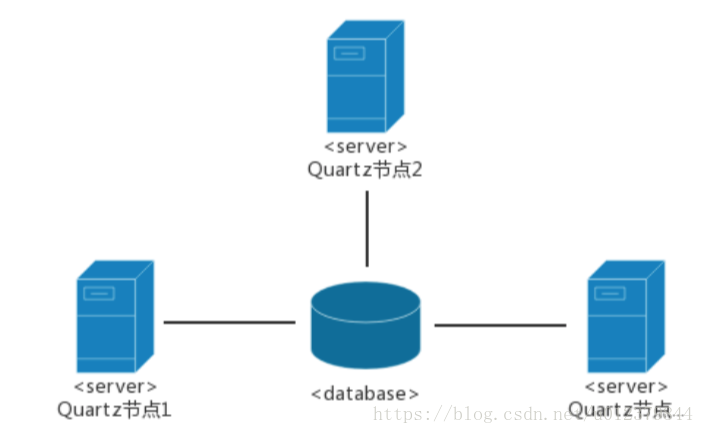
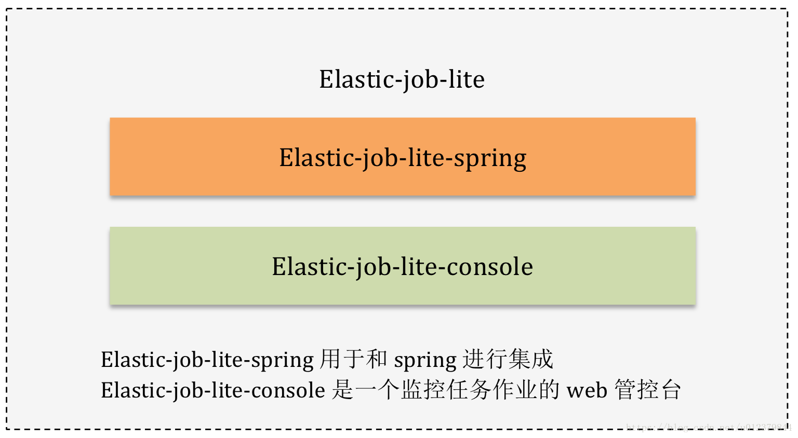
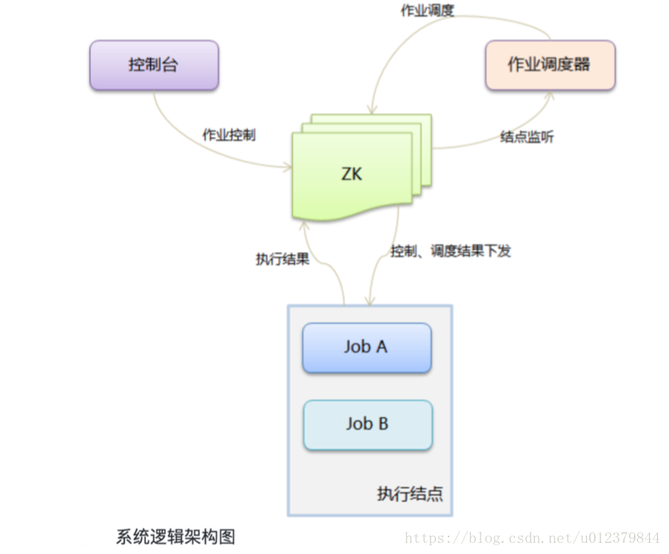

# 什么是分布式任务调度？

分布式任务调度，三个关键词：分布式、任务调度、配置中心。

- 分布式：平台是分布式部署的，各个节点之间可以无状态和无限的水平扩展

- 任务调度：是指基于**给定的时间点 / 给定的时间间隔 / 给定执行次数自动**的执行任务。包括 任务状态管理、任务调度请求收发、具体任务的分配、任务的具体执行（分配到哪些机器上处理）。涉及到多线程并发、运行时间规则定制及解析、线程池的维护等诸多方面的工作

- 配置中心：可以感知整个集群的状态、任务信息的注册，解决一共要处理哪些任务、任务要分配到哪些机器上处理、任务分发的时候判断哪些机器可以用等问题

一个分布式任务调度系统需要以下内容：

- Web模块：用来提供任务的信息，控制任务的状态、信息展示等
- Server模块：负责接收web端传来的任务执行的信息，下发任务调度请求给Scheduler，会去注册中心进行注册
- Scheduler模块：接收server端传来的调度请求，将任务进行更加细化的拆分然后下发，到注册中心进行注册，获取到可以干活的worker
- Worker模块：负责具体的任务执行
- 注册中心

# 任务调度发展历史

任务调度随着技术发展，从单线程调度到多线程调度，从单机部署到集群部署，从独立执行到多任务协同执行。

- 第一阶段
  单线程调度，在Java1.5之前，基于线程的等待(sleep或wait)机制定时执行，需要开发者实现调度逻辑，单个线程(Thread)处理单个任务有些浪费，但是一个线程(Timer)处理多个任务容易因为某个任务繁忙导致其他任务阻塞。

- 第二阶段
  线程池调度，在Java1.5开始提供ScheduledExecutorService调度线程池，调度线程池支持固定的延时和固定间隔模式，对于需要在某天或者某月的时间点执行就不大方便，需要计算时间间隔，转换成启动延时和固定间隔，处理起来比较麻烦。

- 第三阶段
  Spring任务调度，Spring简化了任务调度，通过@Scheduled注解支持将某个Bean的方法定时执行，除了支持固定延时和固定间隔模式外，还支持cron表达式，使得定时任务的开发变得极其简单。

- 第四阶段
  Quartz任务调度，在任务服务集群部署下，Quartz通过数据库锁，实现任务的调度并发控制，避免同一个任务同时执行的情况。Quartz通过Scheduler提供了任务调度API，开发可以基于此开发自己的任务调度管理平台。

- 第五阶段
  分布式任务平台，提供一个统一的平台，无需再去做和调度相关的开发，业务系统只需要实现具体的任务逻辑，自动注册到任务调度平台，在上面进行相关的配置就完成了定时任务的开发。

# 常见的任务调度框架

常见的分布式任务调度框架有：cronsun、Elastic-job、saturn、lts、TBSchedule、xxl-job等

## cronsun

### 概述

cronsun是一个分布式任务系统，单个节点和Linux机器上的contab近似，是为了解决多台Linux机器上crontab任务管理不方便的问题，同时提供了任务高可用的支持（当某个节点死机的时候可以自动调整到正常的节点执行）。与此同时，它还支持界面管理机器上的任务，支持任务失败邮件提醒，安装简单，使用简便，是替换crontab的一个不错的选择。

> **crontab**是Linux系统里面最简单易用的定时任务管理工具，在Linux上由crond来周期性的执行指令列表，执行的任务称为cron job。但是当crontab分布在多个服务器时带来一些问题：
>
> 1. 大量的crontab分散在各台服务器，带来了很高的维护成本；
> 2. 任务没有按时执行，过了很长的时间才能发现，需要重试或者排查；
> 3. crontab分散在很多集群上，需要一台一台的去查看日志；
> 4. crontab存在单点问题，对于不能重复执行的定时任务很伤脑；
>
> 因此非常需要一个集中管理定时任务的系统，于是就有了cronsun

### 系统架构

cronsun中主要有三个组件，都是通过etcd通讯的。

- cronnode负责节点的分组及节点的状态
- cronweb是用来管理任务的、任务的执行结果都可以在上面看

> etcd是一个开源的、分布式的键值对数据存储系统，提供共享配置、服务的注册和发现。etcd内部采用raft协议作为一致性算法，是基于Go语言实现的。

所有的任务都会存储在一个分布式etcd里，单个crond部署成一个服务，也就是图中所示的node.1、node.2、node.n等，然后再由web界面去管理。如果任务执行失败的话，会发送失败的邮件，当单个节点死机的时候，也会自动调整到正常的节点去执行任务。

## Quartz

Quartz是OpenSymphony开源组织在任务调度领域的一个开源项目，完全基于java实现。

Quartz具有以下特点：强大的调度功能、灵活的应用方式、分布式和集群能力，另外作为spring默认的调度框架，很容易实现与Spring集成，实现灵活可配置的调度功能。

Quartz的核心元素如下：

1. Scheduler：任务调度器，是实际执行任务调度的控制器
2. Trigger；触发器，用于定义任务调度的时间规则
3. Calendar：它是一些日历特定时间的集合，一个Trigger可以包含多个Calendar，以便于排除或包含某些时间点
4. JobDetail：用来描述Job实现类及其他相关的静态信息，如Job的名字、关联监听器等信息
5. Job：是一个接口，只有一个方法void execute(JobExecutionContext context)，开发者实现该接口定义运行任务，JobExecutionContext类提供了调度上下文的各种信息

  ### Quartz单机版

Quartz单机版的集群方案是使用数据库来实现的。集群架构如下：

上图3个节点在数据库中都有同一份Job定义，如果某一个节点失效，那么Job会在其他节点上执行。

如何保证只有一台机器上触发呢？答案是使用了数据库锁。在quartz集群有张scheduler_locks，采用了悲观锁的方式对triggers表进行了行加锁，以保证任务同步的正确性。

### 总结

简单来说，quartz的分布式调度策略是以数据库为边界的一种异步策略。各个调度器都遵守一个基于数据库锁的操作规则从而保证了操作的唯一性，同时多个节点的异步运行保证了服务的可靠。

但这种策略有自己的局限性：集群特性对于高CPU使用率的任务效果特别好，但是对于大量的短任务，各个节点都会抢占数据库锁，这样就出现大量的线程等待资源。Quartz的分布式只解决了任务高可用的问题，并没有解决任务分片的问题，还是会有单机处理的极限。

## Elastic-job

Elastic-job是当当开源的一款非常好用的作业框架，Elastic-job在2.x之后，出现了两个相互独立的产品线：Elastic-job-lite和Elastic-job-cloud。

### Elastic-job-lite

Elastic-job-lite定位为轻量级无中心化的解决方案，使用jar包的形式提供分布式任务的协调服务，外部依赖仅依赖于zookeeper。

#### 系统架构

`Elastic-job-lite`框架使用`zookeeper`作为注册中心，`Elastic-job-lite`框架通过监听感知`zookeeper`数据的变化，并做相应的处理；运维平台也仅是通过读取zk数据来展现作业状态，或是更新`zookeeper`数据修改全局配置。运维平台和`Elastic-job-lite`没有直接的关系，完全解耦合。

`Elastic-job-lite`并不直接提供数据处理的功能，框架只会将分片项分配给各个正在运行中的服务器，分片项与真实数据的对应关系需要开发者在应用程序中自行处理。

`Elastic-job-lite`并无作业调度中心节点，而是基于部署作业框架的程序在到达相应时间点时各自触发调度。注册中心仅用于作业注册和监控信息存储，而主作业节点仅用于处理分片和清理的功能。

> **分片**：任务的分布式执行，需要将一个任务拆分为多个独立的任务项，然后由分布式的服务器分别执行某一个或几个分片项。

`elastic`底层的任务调度还是使用的`Quartz`，通过`zookeeper`来动态给job节点分片。

### Elastic-job-cloud

Elastic-job-cloud包含了Elastic-job-lite的全部功能，它是以私有云平台的方式提供集资源、调度以及分片为一体的全量级解决方案，依赖于Mesos和Zookeeper，它额外提供了资源治理、应用分发以及进程隔离等服务。他们两个提供同一套API开发作业，开发者仅需一次开发，然后可根据需要以lite或cloud的方式部署。

> **Mesos** ——像用一台电脑一样使用整个数据中心
>
> 是Apache下的开源分布式资源管理框架，它被称为分布式系统的内核，是以与Linux内核同样的原则而创建的，不同点仅仅是在于抽象的层面。使用ZooKeeper实现Master和Slave的容错。

## saturn

Saturn（定时任务调度系统）是唯品会自主研发的分布式的定时任务的调度平台，它是基于Elastic-job版本1开发的。目标是取代传统的`Linux Cron`/`Spring Batch Job`/`Quartz`的方式，做到全域统一配置、统一监控、任务高可用以及分片。Saturn的任务可以使用多种语言开发，比如python、Go、Shell、Java、Php等。

### 系统架构

Saturn包括两大部分，Saturn Console和Saturn Executor。

- Console是一个WEB UI，用来对作业/Executor的管理，统计报表展现等。他同时也是整个调度系统的大脑：将作业任务分配到各Executor。
- Executor是执行任务的worker：按照作业配置的要求去执行部署于Executor所在容器或物理机当中的作业脚本和代码。

Saturn高度依赖于zookeeper，每个executor及调度服务都会在zookeeper上进行注册，确保调度程序能够及时得到executor的状态。

Saturn定时任务调度的**最小单位是分片**，即任务的一个执行单元。Saturn的基本任务就是将任务分成多个分片，并将每个分片通过算法调度到对应的executor上去执行。

### 基本原理

Saturn的基本原理是将作业在逻辑上划分为若干个分片，通过作业分片调度器将作业分片指派给特定的执行节点。执行节点通过Quartz触发执行作业的具体实现，在执行的时候，会将分片序号和参数作为参数传入。作业的实现逻辑需分析分片序号和分片参数，并以此为依据来调用具体的实现（比如一个批量处理数据库的作业，可以划分0号分片处理1-10号数据库，1号分片可以处理11-20号数据库）。

## lts

LTS是一个轻量级分布式任务调度框架，主要用于解决分布式任务的调度问题，支持实时任务、定时任务和Cron任务，有较好的伸缩性、扩展性以及健壮稳定性。参考hadoop的思想，主要有以下四个节点：

- JobClient：主要负责提交任务，并接收任务执行的反馈结果
- JobTracker：负责接收并分配任务，任务调度
- TaskTracker：负责执行任务，执行完反馈给JobTracker
- LTS-Admin：（管理后台）主要负责节点管理，任务队列管理，监控管理等

其中JobClient、JobTracker、TaskTracker是无状态的，可以部署多个并动态的进行删减，来实现负载均衡，实现更大的负载量，并且框架采用FailStore策略使得LTS具有很好的容错能力。

一个典型的定时任务，大概的执行流程如下：

1. 添加任务以后在注册中心进行注册，zk集群会暴露各个节点的信息，进行master节点选举等
2. JobClient将任务进行提交，如果成功的话将进行下一步；否则的话进入FailStore，重试
3. JobTracker接收并分配任务，如果任务已经存在，则结束；否则任务进入可执行队列ExecutableJobQueue，接着进入执行中任务队列ExecutingJobQueue，最后发送给TaskTracker进行执行
4. TaskTracker执行完毕后，将结果反馈给客户端；如果反馈成功，则回到JobClient执行下一个任务；否则的话进入FeedbackJobQueue重试

## TBSchedule

TBSchedule是一款非常优秀的分布式调度框架，广泛应用于阿里巴巴、淘宝、支付宝、京东、汽车之家等很多互联网企业的流程调度系统。TBSchedule在时间调度方面虽然没有quartz强大，但是它支持分片的功能。和quartz不同的是，TBSchedule使用zk来实现任务调度的高可用和分片。纯java开发。

TBSchedule项目实际上可以分为两部分。1）schedule管理控制台。负责控制、监控任务执行状态。2）实际执行job的客户端程序。

在实际使用时，需要先启动zk，然后部署TBSchedule web界面的管理控制台，最后启动实际执行job的客户端程序。这里的zk并不实际控制任务调度，它只是负责与N台执行job任务的客户端进行通讯，协调、管理、监控这些机器的运行信息。实际分配任务的是管理控制台，控制台从zk获取job的运行信息。

TBSchedule通过控制ZNode的创建、修改、删除来间接控制job的执行，执行任务的客户端监听它们对应ZNode的状态更新事件，从而达到TBSchedule控制job执行的目的。

特点：

1. TBSchedule的分布式机制是通过灵活的Sharding方式实现的，比如可以按所有数据的ID按10取模分片、按月份分片等，根据不同的场景由客户端配置分片规则。
2. TBSchedule的宿主服务器可以进行动态的扩容和资源回收，这个特点主要是因为它后端依赖的zooKeeper，这里的zooKeeper对于TBSchedule来说相当于NoSQL，用于存储策略、任务、心跳等信息数据，他的数据结构类似于文件系统的目录结构，他的节点有临时节点、持久节点之分。一个新的服务器上线后，会在zk中创建一个代表当前服务器的一个唯一性路径（临时节点），并且新上线的服务器会和zk保持长连接，当通信断开后，节点会自动删除。
3. TBSchedule会定时扫描当前服务器的数量，重新进行任务分配。
4. TBSchedule不仅提供了服务端的高性能调度服务，还提供了一个scheduleConsole war随着宿主应用的部署直接部署到服务器，可以通过web的方式对调度的任务、策略进行监控管理，以及实时更新调整。

## xxl-job

xxl-job是一个轻量级的分布式任务调度框架，其核心设计目标是开发迅速、学习简单、轻量级、易扩展。

### 设计思想

  （1）将调度行为抽象形成“调度中心”公共平台，而平台自身并不承担业务逻辑，“调度中心”负责发起调度请求

  （2）将任务抽象成分散的JobHandler，交由执行器统一管理，执行器负责接收调度请求并执行对应的JobHandler中业务逻辑

调度系统与任务解耦，提高了系统可用性和稳定性，同时调度系统性能不再受限于任务模块

### 系统架构

  xxl-job系统的组成分为：

1. 调度模块（调度中心）：负责管理调度信息，按照调度配置发出调度请求，自身不承担业务代码。支持可视化、简单且动态的管理调度信息，包括任务新建，更新，删除，GLUE开发和任务报警等，所有上述操作都会实时生效，同时支持监控调度结果以及执行日志，支持执行器Failover。
2. 执行模块（执行器）：负责接收调度请求并执行任务逻辑。任务模块专注于任务的执行等操作，开发和维护更加简单和高效；接收“调度中心”的执行请求、终止请求和日志请求等。

### 执行流程

1. 准备一个将要执行的任务
2. 任务开启后到执行器中注册任务的信息
3. 加载执行器的配置文件
4. 初始化执行器的信息
5. 执行器start
6. 在admin端配置任务信息，配置执行器的信息

# 对比

| 对比内容                     | cronsun                                                      | xxl-job                                                      | Elastic-job                                                  | saturn                                                       | lts                                                          | TBSchedule                                                   |
| ---------------------------- | ------------------------------------------------------------ | ------------------------------------------------------------ | ------------------------------------------------------------ | ------------------------------------------------------------ | ------------------------------------------------------------ | ------------------------------------------------------------ |
| 项目背景                     | 替代crontab                                                  | 大众点评、文档齐全                                           | 当当网开源、文档齐全                                         | 唯品会自主研发，基于当当的Elastic-job版本1                   | --                                                           | 阿里早期开源、代码略陈旧                                     |
| 语言                         | Go                                                           | Java                                                         | Java                                                         | Java                                                         | Java                                                         | Java                                                         |
| 依赖                         | etcd mongodb                                            | mysql jdk1.7+ maven3.0+                            | jdk1.7+ zookeeper 3.4.6+  maven3.0.4+ mesos mysql | JDK 7 or JDK 8      Maven 3.0.4+      node.js 8.7.0+      npm 5.4.2+      docker (版本不限) | CentOs maven java MySQL                       |                                                              |
| 易用、易部署                 | 安装简单、使用简便                                           | 支持通过Web页面对任务进行CRUD操作，操作简单，一分钟上手      | 易用易部署                                                   | 可以很好的部署到docker容器上                                 | 易用，难部署                                                 |                                                              |
| web界面统一管理任务          | cronweb界面可以管理任务                                      | xxl-job-admin提供了web界面，同时也是作为任务调度中心         | 提供运维界面elastic-job-lite-console，可以管理作业和注册中心 | Saturn  Console                                              | lts-admin                                                    |                                                              |
| 多节点部署时任务不能重复执行 | 支持任务单次执行                                             | “调度中心”通过DB锁保证集群分布式调度的一致性,  一次任务调度只会触发一次执行 | 容错处理：作业服务器与Zookeeper服务器通信失败则立即停止作业运行，防止作业注册中心将失效的分片分项配给其他作业服务器，而当前作业服务器仍在执行任务，导致重复执行                幂等性：重复作业任务项判定，不重复执行已运行的作业任务项 |                                                              | 容错处理                                                     | 支持                                                         |
| 日志可追溯                   | 有日志查询界面，并已支持日志清除                             | 支持在线查看调度结果，并且支持以Rolling方式实时查看执行器输出的完整的执行日志（数据库） | 支持，有日志查询界面，job的运行日志将会记录到数据库里        | saturn-executor-log.log(executor日志)saturn-executor.log(job日志) | 在TaskTracker端提供了业务日志记录器                          |                                                              |
| 弹性扩容缩容                 |                                                              | 一旦有新执行器机器上线或者下线，下次调度时将会重新分配任务   | 运行中的作业服务器崩溃，或新增加n台作业服务器，作业框架将在下次作业执行前重新分片，不影响当前作业执行 | 能支持容器化技术进行自动executor扩容和减容，保证高峰期处理能力的弹性伸缩。 | 因为LTS各个节点都是无状态的，所以支持动态增加删除节点，达到负载均衡的目的 | （2）  TBSchedule的宿主服务器可以进行动态的扩容和资源回收    |
| 报警                         | 邮件提醒，由cronweb界面发出，而不是cronnode                  | 任务失败邮件报警，支持配置多邮箱地址，用逗号隔开             | 可通过事件订阅自行实现                                       | Saturn提供了完善的监控告警机制，能方便开发者进行监控         |                                                              |                                                              |
| 阻塞处理策略                 | 多机单任务(防止单机挂掉任务不按时执行)                       | 策略包括：单机串行、丢弃后续调度、覆盖之前的调度             | zk的session  timeout时间，超过这个时间临时节点将会被清除，作业才会重新分片 | 设置了timeout的作业开始执行后会启动超时检测，如果执行超时，则会停止当前作业的执行 |                                                              |                                                              |
| 支持并行调度                 | 多节点                                                       | 调度系统多线程触发调度运行，确保调度精确执行，不被阻塞       | 将一个任务分为多个小任务在多台服务器上执行                   | 分片                                                         | 多节点                                                       | 支持                                                         |
| 失败处理策略                 | 任务失败重试                                                 | 失败告警、失败重试                                           | 失败转移、被错过的作业重触发                                 | 支持作业HA，负载均衡和失败转移                               | 当节点组中的一个节点当机之后，自动转到其他节点工作。当整个节点组当机之后，将会采用存储文件的方式，待节点组可用的时候进行重发。  当执行任务的TaskTracker节点当机之后，JobTracker  会将这个TaskTracker上的未完成的任务(死任务)，重新分配给节点组中其他节点执行。 | 失效转移                                                     |
| 高可用                       | 当某个节点死机的时候可以自动调度到正常的节点执行             | 如果执行器集群中某一台机器故障，将会自动Failover切换到一台正常的执行器发送调度请求 | 调度器的高可用是通过运行几个指向同一个ZooKeeper集群的Elastic-Job-Cloud-Scheduler实例来实现的。ZooKeeper用于在当前主Elastic-Job-Cloud-Scheduler实例失败的情况下执行领导者选举。通过至少两个调度器实例来构成集群，集群中只有一个调度器实例提供服务，其他实例处于”待命”状态。当该实例失败时，集群会选举剩余实例中的一个来继续提供服务。 | Saturn是面向任务的，能够监控到executor的状态，在executor下线或者上线的时，均会对任务分片进行重分配，保证其可用性。 | 由于上面的失败处理策略，实现了任务的高可用                   | 支持                                                         |
| 路由策略                     | 故障转移                                                     | 第一个、最后一个、轮询、随机、一致性HASH、最不经常使用、最近最久未使用、故障转移、忙碌转移等 | 失效转移                                                     | 失败转移、负载均衡                                           | 故障转移                                                     |                                                              |
| 动态分片                     |                                                              | 分片广播任务以执行器为维度进行分片，支持动态扩容执行器集群从而动态增加分片数量，协同进行业务处理；在进行大数据量业务操作时可显著提升任务处理能力和速度。 | 默认包含三种分片策略：  基于平均分配算法的分片策略、  作业名的哈希值奇偶数决定IP升降序算法的分片策略、根据作业名的哈希值对Job实例列表进行轮转的分片策略，支持自定义分片策略 | 由用户在UI界面输入                                           |                                                              | TBSchedule的分布式机制是通过灵活的Sharding方式实现的，比如可以按所有数据的ID按10取模分片、按月份分片等，根据不同的场景由客户端配置分片规则。 |
| 任务类型                     | 普通任务、单机单进程任务、一个任务执行间隔内允许执行一次     | 提供Web  IDE，支持在线开发任务逻辑代码，动态发布，实时编译生效，省略部署上线的过程。支持30个版本的历史版本回溯。支持以GLUE模式开发和运行脚本任务，包括Shell、Python、NodeJS等类型脚本 | 支持OneOff，Perpetual和SequencePerpetual三种作业模式         | 提供除java作业的基础上增加了shell作业的支持。主要可以支持类似PHP,  Python等脚本作业 | 实时任务：提交了之后立即就要执行的任务。     定时任务：在指定时间点执行的任务，譬如 今天3点执行（单次）。     Cron任务：CronExpression，和quartz类似（但是不是使用quartz实现的）譬如 0 0/1 * ?     Repeat任务：譬如每隔5分钟执行一次，重复50次就停止。 |                                                              |
| 任务在业务中的状态流转       | 所有的任务都会存储在一个分布式etcd里，单个crond部署成一个服务，也就是图中所示的node.1、node.2、node.n等，然后再由web界面去管理 | 将调度的行为抽象成“调度中心”公共平台，“调度中心”负责发起调度请求，将任务抽象成JobHandler，交由执行器管理，执行器负责接收调度请求并执行相应的JobHandler中的业务逻辑 | 首先配置任务的相关信息，然后任务去注册中心进行注册，注册中心完成主节点选举和分片策略的设置。Quarzt  job一旦触发，则任务执行。任务执行后，处理错过的任务以及监听事件 | 将作业在逻辑上划分为若干个分片，通过作业分片调度器将作业分片指派给特定的执行节点。执行节点通过quartz触发执行作业的具体实现，在执行的时候，会将分片序号和参数作为参数传入。作业的实现逻辑需分析分片序号和分片参数，并以此为依据来调用具体的实现 | 任务到注册中心进行注册，JobClient将任务进行提交，JobTracker接收并分配任务，TaskTracker执行任务，并将结果反馈给客户端 |                                                              |
| 任务进度监控                 | 在cronweb添加完成任务之后，在任务标签页就能看到所有添加的定时任务以及执行情况 | 支持实时监控任务进度                                         | 监控作业运行时状态，统计最近一段时间处理的数据成功和失败数量，记录作业上次运行开始时间，结束时间和下次运行时间。 | Saturn通过统一的控制台进行全部域及全部作业的配置，执行情况监控，结点监控等 | 这些业务日志可以通过任务ID串联起来，可以在LTS-Admin中实时查看任务的执行进度 | schedule管理控制台。负责控制、监控任务执行状态。             |
| 自定义任务参数               | 在cronweb添加定时任务时，可以指定任务执行脚本和参数          | 支持在线配置调度任务入参，即时生效                           | 在修改任务时，可以自定义参数                                 | 可以在界面中配置任务的参数                                   |                                                              |                                                              |
| 安全设置                     | 支持security.json安全设置                                    | 调度中心向执行器发送的调度请求时使用RequestModel和ResponseModel两个对象封装调度请求参数和响应数据,  在进行通讯之前底层会将上述两个对象对象序列化，并进行数据协议以及时间戳检验,从而达到数据加密的功能 |                                                              |                                                              |                                                              |                                                              |
| 开源地址                     | http://github.com/shunfei/cronsun                            | https://github.com/xuxueli/xxl-job                           | https://github.com/elasticjob/elastic-job-lite               | https://github.com/vipshop/Saturn                            | https://github.com/ltsopensource/light-task-scheduler        |                                                              |

参考：https://www.cnblogs.com/chen-chen-chen/p/12221923.html

​           https://blog.csdn.net/u012379844/article/details/82716146